# Sentriq

An AI-assisted security remediation pipeline. Sentriq scans a repository (or a running web target) with several open-source security tools, merges everything into one schema, deduplicates across tools, has an LLM triage each finding as real, false positive or noise, and turns the ones you choose into reviewed, batched fix pull requests. Every stage writes to an append-only provenance log that backs an ASPM-style metrics dashboard.

This repository is named `CI-SAST` for historical reasons; the product is Sentriq. The full documentation set lives in [`docs/`](docs/README.md).

## The problem

Running Semgrep, Trivy and Gitleaks is easy. Living with their output is not: the same issue shows up in several tools, most findings are noise, and the "fix" step is manual. Sentriq automates the grind around the scanners while keeping a person in charge of what actually reaches a pull request.

## How it works

```mermaid
flowchart LR
    SUBMIT(["POST /api/v1/scans"]) --> Q["Celery: run_scan"]
    Q --> PREP{"pipeline"}
    PREP -->|static| CLONE["git clone"] --> SAST["gitleaks + semgrep + trivy<br/>(official Docker images)"]
    PREP -->|dynamic| DAST["ZAP baseline + nuclei<br/>against a live URL"]
    SAST --> NORM["Adapters normalise to one Finding schema"]
    DAST --> NORM
    NORM --> DEDUP["Deduplicate across tools<br/>(location key, fingerprint fallback)"]
    DEDUP --> PG[("PostgreSQL")]
    PG --> TRIAGE["DeepSeek triage<br/>real / false_positive / noise + citation"]
    TRIAGE --> UI["React dashboard"]
    UI -->|"Fix with AI"| FIX["LLM picks old/new text,<br/>difflib builds the diff"]
    FIX -->|"reviewer approves"| PR["One batch PR of approved fixes"]
    PROV[("Append-only provenance events")] -.-> METRICS["ASPM metrics"]
    NORM -.-> PROV
    TRIAGE -.-> PROV
    FIX -.-> PROV
    PR -.-> PROV
```



1. **Scan.** A scan request queues a Celery task. Static scans clone the repo and run gitleaks (secrets), Semgrep (SAST) and Trivy (dependencies); dynamic scans point ZAP's baseline scan and nuclei at a URL. Each tool is an adapter that runs its official image through the host Docker daemon and parses the tool's native output.
2. **Normalise and deduplicate.** Adapters emit one `Finding` shape (`sentriq/schema.py`). The aggregator collapses the same issue reported by several tools into one record, keeping the highest severity and listing every contributing tool in `also_reported_by`.
3. **Triage.** Each finding goes to DeepSeek with a code snippet and comes back as `real`, `false_positive` or `noise` with a confidence and a citation. If the LLM is unavailable the verdict fails safe to `real`, so nothing is silently dropped. `LLM_ENABLED=false` runs scanners with no LLM calls at all.
4. **Fix on demand.** Nothing is patched automatically. Clicking *Fix with AI* on a finding enqueues a fix task; the reviewer then approves or rejects it.
5. **Batch PR.** *Create PR* opens a single branch and pull request containing only the approved fixes.
6. **Provenance and metrics.** Scan steps, tool runs, triage verdicts, fixes and approvals are recorded as append-only events; the metrics endpoint rolls them up for the dashboard.

### Design decisions

- **The LLM never writes a diff.** It returns the exact text to replace (`old_str`) and the replacement (`new_str`); the backend computes the unified diff from the real file with `difflib`. Models cannot count lines, and diffs authored by the model did not apply. The anchor must occur exactly once in the file or the fix is rejected, so a bad suggestion fails closed instead of corrupting a security PR.
- **Approval is the gate.** A fix existing is the model's opinion; approving it is the human decision. Creating a PR is gated on approval, and this is covered by tests.
- **Scanners stay official images.** No custom scanner images and no Kubernetes needed to run the product; the worker mounts the Docker socket and the shared data directory at an identical host path so nested bind mounts resolve.
- **Adapter contract.** A new scanner is one adapter class (image, command, `parse()`); the aggregator, triage, API and UI do not change.
- **Session cookies, not JWT.** GitHub OAuth login with httpOnly session cookies and CSRF protection; stored GitHub tokens are Fernet-encrypted at rest; PRs are opened with the acting user's own OAuth token, falling back to a configured PAT.
- **Orphaned scans are reaped.** A worker killed mid-scan would otherwise leave a scan "running" forever; a beat job (and worker boot) marks stale scans failed.

## Stack

| Layer | Technology |
|---|---|
| API | Django 5.2, Django REST Framework, GitHub OAuth session auth |
| Async | Celery 5.4 with Celery beat, Redis 7 |
| Data | PostgreSQL 16 |
| Scanners | gitleaks, Semgrep, Trivy, OWASP ZAP baseline, nuclei (Docker) |
| LLM | DeepSeek via its OpenAI-compatible API, plain `httpx`, JSON mode, temperature 0 |
| Frontend | React 18, Vite, Tailwind CSS, Vitest |

## Run it

Local development (Postgres and Redis in Docker, everything else on the host):

```bash
cp .env.example .env                        # DEEPSEEK_API_KEY, GitHub OAuth app, TOKEN_ENCRYPTION_KEY, ...
docker compose -f deps.compose.yml up -d    # Postgres :5433, Redis :6380
cd ci-utils && python -m venv .venv && .venv/bin/pip install -r requirements.txt && cd ..
./start.sh                                  # migrate, API :8000, Celery worker + beat, UI :3000
```

Open http://localhost:3000, sign in with GitHub, pick a repository and scan. The first scan of each type pulls the scanner images, so it is slower. A `401` from the API when you are not logged in is expected.

Everything containerised: `docker compose up --build` (API on `:8080`, UI on `:3000`). See [docs/10-deployment.md](docs/10-deployment.md).

### Tests

```bash
cd ci-utils
USE_SQLITE=1 .venv/bin/python manage.py test tests    # backend suite
USE_SQLITE=1 .venv/bin/python smoke_test.py           # end-to-end run with tools and LLM mocked
cd ../sentriq-frontend && npm test
```

## API

| Method | Path | Purpose |
|---|---|---|
| POST | `/api/v1/scans` | Submit a scan `{pipeline: static\|dynamic, target, ref?, auto_fix_severity?}` |
| GET | `/api/v1/scans`, `/scans/{id}` | List and inspect scans |
| GET | `/api/v1/findings` | Filter by `severity`, `tool`, `type`, `verdict`, `scan` |
| GET | `/api/v1/findings/{id}` | Finding with triage, fixes and approval history |
| POST | `/api/v1/findings/{id}/fix` | Generate a fix on demand (`202`) |
| POST | `/api/v1/findings/{id}/hitl` | Approve, deny or edit a fix |
| POST | `/api/v1/pr` | One PR containing every approved fix for a repository |
| GET | `/api/v1/provenance?scan=` | Append-only audit trail |
| GET | `/api/v1/metrics` | ASPM rollup |

## Documentation

Each component doc quotes the code it describes. If a doc and the code disagree, the code is right.

| Start here | |
|---|---|
| [PROJECT-STATE](docs/PROJECT-STATE.md) | What works, what is verified, what is not |
| [concerns](docs/concerns.md) | Known gaps and risks, with cost to fix |
| [00-overview](docs/00-overview.md) | The pipeline end to end |

Component docs: [schema](docs/01-schema.md), [adapters](docs/02-adapters.md), [executor](docs/03-executor.md), [aggregator](docs/04-aggregator.md), [DeepSeek layer](docs/05-deepseek.md), [data model](docs/06-data-model.md), [orchestration](docs/07-orchestration.md), [API](docs/08-api.md), [frontend](docs/09-frontend.md), [deployment](docs/10-deployment.md).

## Status

Working end to end on the static pipeline: scan, triage, on-demand fix, approval and batch PR. The honest list of what is not yet proven (the dynamic ZAP/nuclei pipeline has never completed a run, the frontend flows have been build-checked but not click-tested) is in [PROJECT-STATE](docs/PROJECT-STATE.md) and [concerns](docs/concerns.md). Triage sends code snippets, and fix generation sends the affected file, to DeepSeek's API; use `LLM_ENABLED=false` where that is not acceptable.

## Layout

```
ci-utils/
  ciutils/        Django project, Celery app and beat schedule
  sentriq/        schema, adapters, executor, aggregator, deepseek, tasks, models, API, OAuth
  tests/          backend tests
sentriq-frontend/ React dashboard
docs/             component documentation
deps.compose.yml  Postgres + Redis for local development
docker-compose.yml full containerised stack
```

`ci-utils/orchestrator/`, `k8s/`, `tools/`, `deploy/` and `frontend/` are the earlier Kubernetes-Job and GitLab CI iteration of this idea; they are kept for reference and are not wired into the current API.
