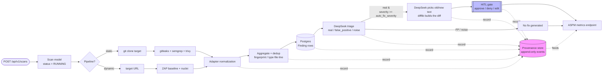
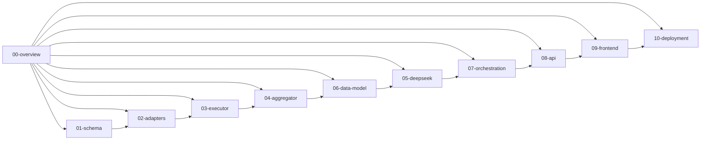

# Sentriq AI Overview

> Sentriq is an AI security remediation pipeline that scans code and running apps with multiple security tools, normalizes every finding into one schema, uses DeepSeek to triage and propose fixes, and surfaces the results through a human-in-the-loop approval gate and an ASPM metrics dashboard.

## Role in the pipeline

This document describes the whole Sentriq system from end to end. It sits above the component-specific docs and shows how a scan request flows through execution, normalization, aggregation, deduplication, persistence, LLM triage, fix generation, human review, and metrics. The other docs in this directory drill into each box in the diagrams below.

## How it works

Sentriq runs a **single-pipeline core loop** implemented in `ci-utils/sentriq/tasks.py`. A scan is submitted through the API, then a Celery worker runs the pipeline stages below. Provenance is recorded at every stage.

### Static vs dynamic pipelines

- **Static pipeline** — runs against source code. Adapters launched: `gitleaks` (secrets), `semgrep` (SAST), and `trivy` (SCA). The worker first clones the git repository into a scratch directory.
- **Dynamic pipeline** — runs against a live target URL. Adapters launched: OWASP ZAP baseline and `nuclei`.

Both pipelines use the same `Finding` schema, the same aggregator, the same DeepSeek triage/fix step, and the same persistence layer.

### Full flow

1. **Scan submit** — `POST /api/v1/scans` with `{pipeline: static|dynamic, target, ref?}`. A `Scan` row is created and the Celery task `sentriq.run_scan` is queued.
2. **Prepare** — for static scans the repo is cloned with `executor.git_clone`; for dynamic scans no clone is needed.
3. **Run tools** — `for_pipeline(scan.pipeline)` returns the adapters for that pipeline. Each adapter runs its official Docker image via `executor.run_tool` and returns native findings.
4. **Normalize** — every adapter converts native tool output into the unified `Finding` model defined in `sentriq/schema.py`.
5. **Aggregate + dedup** — `sentriq/aggregator.py` deduplicates by fingerprint and by semantic key (`type·file·line`) across all tools in the scan.
6. **Persist** — deduplicated findings are written to Postgres as `Finding` rows, linked to the `Scan`.
7. **DeepSeek triage** — each finding is classified as `real`, `false_positive`, or `noise`, with a confidence score, rationale, and citation.
8. **DeepSeek fix** — for findings marked `real` whose severity is at least the scan's `auto_fix_severity`, DeepSeek names the exact text to replace and the backend computes a unified-diff patch from the real file with `difflib`.
9. **HITL gate** — reviewers use the frontend or `POST /api/v1/findings/{id}/hitl` to `approve`, `deny`, or `edit` a fix suggestion. The action is stored in `HitlAction`.
10. **ASPM metrics** — the `/api/v1/metrics` endpoint rolls up scans, findings, verdicts, and HITL actions into dashboard-level risk posture.

Provenance is written at every transition via `ProvenanceEvent.record`, producing an append-only audit trail that can be queried with `/api/v1/provenance?scan=`.

## Code walkthrough

The orchestration entry point is the Celery task `run_scan`:

```python
@shared_task(name="sentriq.run_scan")
def run_scan(scan_id: str) -> dict:
    scan = Scan.objects.get(id=scan_id)
    scan.status = Scan.RUNNING
    scan.tools_requested = [a.NAME for a in for_pipeline(scan.pipeline)]
    scan.save(update_fields=["status", "tools_requested"])
    ProvenanceEvent.record(ProvenanceEvent.SCAN, "scan started", scan=scan,
                           pipeline=scan.pipeline, target=scan.target)

    work_dir = executor.make_scratch(str(scan.id))
    try:
        if scan.pipeline == STATIC:
            try:
                executor.git_clone(scan.target, scan.ref, work_dir)
                ProvenanceEvent.record(ProvenanceEvent.SCAN, "repo cloned",
                                       scan=scan)
            except Exception as exc:
                detail = getattr(exc, "stderr", "") or str(exc)
                scan.status = Scan.FAILED
                scan.error = f"clone failed: {detail}"[:2000]
                scan.finished_at = timezone.now()
                scan.save()
                ProvenanceEvent.record(ProvenanceEvent.SCAN, "clone failed",
                                       scan=scan, error=detail[:500])
                return {"scan": str(scan.id), "status": scan.status}

        raw_findings, done, failed = _run_tools(scan, work_dir)
        findings = deduplicate(raw_findings)
        rows = _persist_findings(scan, findings)
        _triage_and_fix(scan, rows, work_dir)

        scan.tools_done = done
        scan.tools_failed = failed
        scan.summary = summarize(findings)
        scan.status = Scan.PARTIAL if failed else Scan.COMPLETE
        if not done and failed:
            scan.status = Scan.FAILED
        scan.finished_at = timezone.now()
        scan.save()
        ProvenanceEvent.record(ProvenanceEvent.SCAN, f"scan {scan.status}",
                               scan=scan, findings=len(rows),
                               tools_done=done, tools_failed=failed)
        logger.info("[%s] %s — %d findings (failed: %s)", scan.id, scan.status,
                    len(rows), failed or "none")
        return {"scan": str(scan.id), "status": scan.status,
                "findings": len(rows)}
    finally:
        executor.cleanup(work_dir)
```

This is the backbone of the whole pipeline: set the scan running, clone if static, run the tools, deduplicate, persist, triage/fix, and finalize the status. Every major step is wrapped in a provenance event.

The tool runner iterates over the pipeline's adapters and records per-tool outcomes:

```python
def _run_tools(scan: Scan, work_dir: str):
    """Run every adapter for the scan's pipeline; return (findings, done, failed)."""
    findings, done, failed = [], [], []
    for adapter in for_pipeline(scan.pipeline):
        run = executor.run_tool(adapter, scan.target, work_dir,
                                timeout=config.TOOL_TIMEOUT_SECONDS)
        if run.ok:
            findings.extend(run.findings)
            done.append(adapter.NAME)
            ProvenanceEvent.record(
                ProvenanceEvent.SCAN, f"{adapter.NAME} completed", scan=scan,
                tool=adapter.NAME, findings=len(run.findings),
                duration_s=round(run.duration_s, 1))
        else:
            failed.append(adapter.NAME)
            ProvenanceEvent.record(
                ProvenanceEvent.SCAN, f"{adapter.NAME} failed", scan=scan,
                tool=adapter.NAME, error=run.error,
                stderr=run.stderr_tail[-200:])
        logger.info("[%s] %s -> ok=%s findings=%d", scan.id, adapter.NAME,
                    run.ok, len(run.findings))
    return findings, done, failed
```

Each adapter runs its official container through the host Docker daemon; on success its normalized findings are collected, on failure the error tail is saved into provenance.

Persistence writes every deduplicated finding to Postgres:

```python
def _persist_findings(scan: Scan, findings) -> list:
    rows = []
    for f in findings:
        row = Finding.objects.create(
            scan=scan, tool=f.tool, pipeline=f.pipeline, type=f.type,
            severity=f.severity, severity_score=f.severity_score,
            rule_id=f.rule_id, message=f.message, file=f.file, line=f.line,
            url=f.url, details=f.details, fingerprint=f.fingerprint)
        rows.append(row)
    ProvenanceEvent.record(ProvenanceEvent.NORMALIZE,
                           "findings aggregated + persisted", scan=scan,
                           count=len(rows))
    return rows
```

Triage and fix generation are skipped when `LLM_ENABLED` is false and are gated by severity to save tokens:

```python
def _triage_and_fix(scan: Scan, rows, work_dir: str) -> None:
    if not config.LLM_ENABLED:
        logger.info("[%s] LLM disabled; skipping triage/fix", scan.id)
        return
    from . import deepseek

    fix_floor = SEV_SCORE.get(scan.auto_fix_severity, 3)
    for row in rows:
        snippet = _context_snippet(work_dir, row.file, row.line)
        t = deepseek.triage(_finding_dict(row), snippet)
        Triage.objects.create(
            finding=row, verdict=t.verdict, confidence=t.confidence,
            rationale=t.rationale, citation=t.citation,
            model=config.DEEPSEEK_MODEL)
        ProvenanceEvent.record(ProvenanceEvent.TRIAGE, f"triaged: {t.verdict}",
                               scan=scan, finding=row, verdict=t.verdict,
                               confidence=t.confidence)
        if t.verdict == Triage.REAL and row.severity_score >= fix_floor:
            fx = deepseek.generate_fix(_finding_dict(row), snippet)
            if fx.ok:
                FixSuggestion.objects.create(
                    finding=row, diff=fx.diff, explanation=fx.explanation,
                    model=config.DEEPSEEK_MODEL)
                ProvenanceEvent.record(ProvenanceEvent.FIX, "fix generated",
                                       scan=scan, finding=row)
```

The `ProvenanceEvent` calls above are what make the pipeline auditable: every tool completion, failure, normalization, triage verdict, and fix generation is stored.

## Diagram

### Full pipeline flowchart



### Component map



## Key decisions & gotchas

- **Single-pipeline core first.** The current build intentionally implements one runnable loop (static + dynamic) rather than the full CI/CD branch flow, IAST, fuzzing, AST-aware RAG, or PR automation shown in the product vision. Those are deferred and the structure is kept additive.
- **Official scanner images.** Scanners run as their official Docker images via the host daemon; the worker mounts `/var/run/docker.sock`. No Kubernetes or custom scanner images are required.
- **Host path sharing.** `HOST_DATA_DIR` must be an absolute path and the same path must be visible to the host and the worker so Docker volume mounts resolve correctly.
- **LLM can be disabled.** Set `LLM_ENABLED=false` to run scanners and persistence without spending DeepSeek tokens.
- **Severity floor for fixes.** Fixes are only generated for findings triaged as `real` with a severity score >= the scan's `auto_fix_severity`. This limits expensive token usage.
- **The LLM never authors a diff.** It picks `old_str`/`new_str`; `difflib` computes the patch against the real file. Asking the model for a diff produced a 100% `git apply` failure rate — see [05-deepseek](05-deepseek.md).
- **Append-only provenance.** `ProvenanceEvent` records are written at every stage and are not mutated; they form the audit trail that backs the ASPM dashboard.
- **Adapter contract.** Every adapter must produce normalized `Finding` objects. The aggregator and downstream stages depend on that contract, so new tools are added by writing a new adapter, not by changing the pipeline core.

## Related docs

- [01-schema.md](./01-schema.md) — the unified `Finding` schema and severity model.
- [02-adapters.md](./02-adapters.md) — how each scanner adapter normalizes native output.
- [03-executor.md](./03-executor.md) — scratch directory, git clone, and Docker tool execution.
- [04-aggregator.md](./04-aggregator.md) — fingerprint and semantic deduplication logic.
- [05-deepseek.md](./05-deepseek.md) — LLM triage and fix generation.
- [06-data-model.md](./06-data-model.md) — Postgres models: `Scan`, `Finding`, `Triage`, `FixSuggestion`, `HitlAction`, `ProvenanceEvent`.
- [07-orchestration.md](./07-orchestration.md) — Celery tasks and the `run_scan` chain.
- [08-api.md](./08-api.md) — DRF endpoints for scans, findings, HITL, provenance, and metrics.
- [09-frontend.md](./09-frontend.md) — React/Vite dashboard for submission, review, and metrics.
- [10-deployment.md](./10-deployment.md) — Docker Compose setup and local/dev deployment notes.
