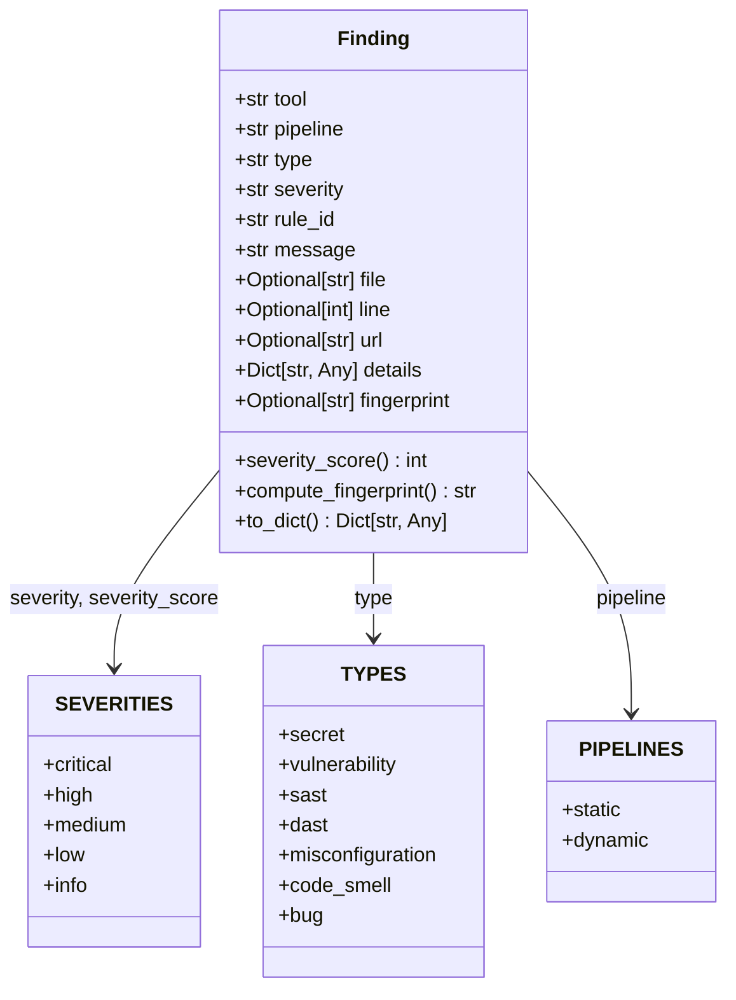

# Unified Findings Schema

> Defines the single contract every scanner adapter normalizes to, so every downstream stage speaks one findings language.

## Role in the pipeline

`ci-utils/sentriq/schema.py` is the first normalization layer in Sentriq. Scanner adapters read raw tool output and emit `Finding` instances in this shape. Everything after the adapter — deduplication, aggregation, triage, fix generation, the API, and the frontend — consumes only these normalized objects, never a tool-native format. It is intentionally a plain dataclass (not a Django model) so adapters, including ones running in subprocesses or built in isolation, can depend on nothing except this file. `Finding.to_dict()` is the serialization boundary; the Django `Finding` model mirrors the same fields for persistence.

## How it works

The module declares three small controlled vocabularies (severity, finding type, pipeline), a `Finding` dataclass, and three helpers: `normalize_severity()`, `validate()`, and `summarize()`.

When a `Finding` is constructed, `__post_init__()` canonicalizes the severity through `normalize_severity()` and, if no fingerprint was supplied, derives a stable identity with `compute_fingerprint()`. That fingerprint is deliberately insensitive to scan-time path prefixes, so the same issue in two different CI jobs still collapses to one. `validate()` gives adapters a cheap, loud guard against bad mappings, and `summarize()` produces an ASPM-style rollup over a batch of findings.

## Code walkthrough

### Controlled vocabularies

The canonical values every adapter maps onto:

```python
# ---- controlled vocabularies -------------------------------------------------
# Severity, normalized across every tool. Ordinal score for sorting/filtering.
SEVERITIES = ("critical", "high", "medium", "low", "info")
SEV_SCORE = {"critical": 4, "high": 3, "medium": 2, "low": 1, "info": 0}

# Finding type taxonomy. Adapters map their native categories onto these.
TYPES = (
    "secret",          # gitleaks
    "vulnerability",   # trivy (CVE), nuclei (CVE templates)
    "sast",            # semgrep static code finding
    "dast",            # zap / nuclei dynamic web finding
    "misconfiguration",
    "code_smell",
    "bug",
)

# Which pipeline a finding belongs to (mirrors the Sentriq CI/CD split).
STATIC = "static"    # SAST + SCA, runs on source
DYNAMIC = "dynamic"  # DAST, runs on a deployed target
PIPELINES = (STATIC, DYNAMIC)
```

`SEVERITIES` and `SEV_SCORE` give a cross-tool severity scale. `TYPES` is the taxonomy adapters map native categories into — for example, gitleaks findings become `secret`, trivy CVEs become `vulnerability`, and semgrep findings become `sast`. `STATIC` covers anything run against source code (`SAST` + `SCA`), while `DYNAMIC` covers runtime/web testing (`DAST`).

### Severity normalization

```python
def normalize_severity(raw: Optional[str], default: str = "low") -> str:
    """Best-effort map any tool's severity string onto SEVERITIES."""
    if not raw:
        return default
    s = str(raw).strip().lower()
    aliases = {
        "blocker": "critical", "crit": "critical",
        "error": "high", "warning": "medium", "warn": "medium",
        "moderate": "medium", "note": "low", "unknown": "low",
        "informational": "info", "information": "info", "none": "info",
    }
    if s in SEVERITIES:
        return s
    return aliases.get(s, default)
```

`normalize_severity()` converts free-form severity strings into the canonical set. Empty or missing values fall back to `low`. Known aliases like `blocker`, `error`, `warning`, and `informational` collapse to their closest canonical value, and anything unrecognized also falls back to `low`.

### The `Finding` dataclass

```python
@dataclass
class Finding:
    """One normalized security finding."""
    tool: str                       # "gitleaks" | "semgrep" | "trivy" | "zap" | "nuclei"
    pipeline: str                   # STATIC | DYNAMIC
    type: str                       # one of TYPES
    severity: str                   # one of SEVERITIES
    rule_id: str                    # tool-native rule/CVE id
    message: str                    # human-readable one-liner
    file: Optional[str] = None      # repo-relative path (static) or URL (dynamic)
    line: Optional[int] = None
    url: Optional[str] = None       # deep link to the tool's own UI / advisory
    # Free-form per-tool extras (cvss, package, fixed_version, entropy, cwe...).
    details: Dict[str, Any] = field(default_factory=dict)
    # Stable cross-scan identity. Auto-derived if not supplied by the adapter.
    fingerprint: Optional[str] = None
```

Every field has a single, pipeline-aware meaning:

| Field | Meaning |
|-------|---------|
| `tool` | Source scanner — currently one of `gitleaks`, `semgrep`, `trivy`, `zap`, or `nuclei`. |
| `pipeline` | `static` for source-based analysis, `dynamic` for runtime/web analysis. |
| `type` | Normalized finding category from `TYPES`. |
| `severity` | Canonical severity from `SEVERITIES`, normalized at creation time. |
| `rule_id` | Tool-native identifier such as a Semgrep rule id, CVE, or gitleaks rule name. |
| `message` | Human-readable one-line description. |
| `file` | Repository-relative path for static findings; URL for dynamic findings. |
| `line` | Line number in the file, when available. |
| `url` | External deep link — advisory, CVE page, or tool UI. |
| `details` | Free-form dictionary for tool-specific metadata (`cvss`, `package`, `fixed_version`, `entropy`, `cwe`, etc.). |
| `fingerprint` | Stable cross-scan identity; computed automatically unless an adapter supplies a native one. |

### Post-init normalization

```python
    def __post_init__(self):
        self.severity = normalize_severity(self.severity)
        if self.fingerprint is None:
            self.fingerprint = self.compute_fingerprint()
```

Construction always rewrites `severity` to the canonical vocabulary and computes a fingerprint if the adapter did not provide one.

### Severity score

```python
    @property
    def severity_score(self) -> int:
        return SEV_SCORE.get(self.severity, 0)
```

`severity_score` returns the ordinal used for sorting and filtering. `critical` = 4, `high` = 3, `medium` = 2, `low` = 1, `info` = 0.

### Fingerprint and why path prefixes are excluded

```python
    def compute_fingerprint(self) -> str:
        """Deterministic identity: tool + rule + location.

        Deliberately excludes any scan-time path prefix (e.g. /repos/{job}/) so
        the same issue matches across scans — the property that makes dedup and
        cross-scan resolution work. Adapters that already have a stable native
        fingerprint should pass it explicitly instead.
        """
        basis = f"{self.tool}:{self.rule_id}:{self.file or ''}:{self.line or ''}"
        return hashlib.sha1(basis.encode()).hexdigest()[:16]
```

The fingerprint is a 16-character SHA-1 digest built from `tool`, `rule_id`, `file`, and `line`. It intentionally does **not** include absolute or scan-time path prefixes such as `/repos/{job}/`, because those change from run to run. Excluding them makes the same logical finding match across scans, which is what powers deduplication and cross-scan resolution. Adapters that already have a stable native fingerprint can bypass this by setting `fingerprint` explicitly.

### Serialization

```python
    def to_dict(self) -> Dict[str, Any]:
        d = asdict(self)
        d["severity_score"] = self.severity_score
        return d
```

`to_dict()` is the serialization boundary. It materializes the dataclass as a dictionary and adds the computed `severity_score` so downstream consumers do not have to recalculate it.

### Validation

```python
def validate(f: Finding) -> None:
    """Raise ValueError if a Finding violates the contract. Cheap guard adapters
    (and delegated code) can call so a bad mapping fails loud, not silently."""
    if f.tool not in ("gitleaks", "semgrep", "trivy", "zap", "nuclei"):
        raise ValueError(f"unknown tool: {f.tool!r}")
    if f.pipeline not in PIPELINES:
        raise ValueError(f"bad pipeline: {f.pipeline!r}")
    if f.type not in TYPES:
        raise ValueError(f"bad type: {f.type!r}")
    if f.severity not in SEVERITIES:
        raise ValueError(f"bad severity: {f.severity!r}")
    if not f.rule_id:
        raise ValueError("rule_id required")
```

`validate()` is the contract enforcer. It raises `ValueError` for unknown tools, bad pipelines, invalid types or severities, or missing `rule_id`. It is intended to be called by adapters or delegated code so mapping bugs fail loudly instead of silently corrupting downstream data.

### Summarization

```python
def summarize(findings: List[Finding]) -> Dict[str, Any]:
    """ASPM-style rollup over a list of findings."""
    by_sev = {s: 0 for s in SEVERITIES}
    by_tool: Dict[str, int] = {}
    by_type: Dict[str, int] = {}
    files = set()
    for f in findings:
        by_sev[f.severity] += 1
        by_tool[f.tool] = by_tool.get(f.tool, 0) + 1
        by_type[f.type] = by_type.get(f.type, 0) + 1
        if f.file:
            files.add(f.file)
    return {
        "total": len(findings),
        "files_affected": len(files),
        "by_severity": by_sev,
        "by_tool": by_tool,
        "by_type": by_type,
    }
```

`summarize()` produces an ASPM-style rollup: total findings, number of distinct files affected, and counts grouped by severity, tool, and finding type.

## Diagram



## Key decisions & gotchas

- **Plain dataclass, not Django.** The contract is kept dependency-free so adapters in subprocesses or isolated environments can import only this file.
- **`file` semantics differ by pipeline.** For static findings it is a repo-relative path; for dynamic findings it is a URL.
- **`details` is intentionally free-form.** Tool-specific metadata such as `cvss`, `package`, `fixed_version`, `entropy`, and `cwe` lives here without polluting the top-level schema.
- **Fingerprint excludes scan-time prefixes.** This is the design choice that makes cross-scan deduplication work, but it assumes adapters provide repo-relative paths.
- **Adapters can override the fingerprint.** If a scanner already has a stable native identifier, pass it as `fingerprint` and `compute_fingerprint()` will be skipped.
- **Validation tool list is hardcoded.** `validate()` currently knows `gitleaks`, `semgrep`, `trivy`, `zap`, and `nuclei`. Adding a new scanner requires updating this tuple.
- **Missing severity falls back to `low`.** `normalize_severity()` never raises; unrecognized or empty input defaults to `low`.

## Related docs

- [00-overview](00-overview.md)
- [02-adapters](02-adapters.md)
- [04-aggregator](04-aggregator.md)
- [06-data-model](06-data-model.md)
- [07-orchestration](07-orchestration.md)
