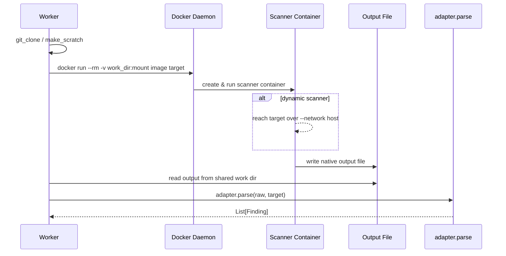

# Local Tool Executor

> Runs each scanner as its official Docker container through the host Docker daemon and converts the tool's native output file into Sentriq findings.

## Role in the pipeline

The executor is the bridge between the orchestration layer and the scanner adapters. It receives a concrete adapter, target, and scan id, prepares a shared work directory, invokes the scanner image, and hands the produced output file back to the adapter's parser. The rest of the pipeline only sees the returned `ToolRun` object, never the raw `docker` command.

## How it works

For static scans, the executor clones the target repository into the work directory using `git_clone`. For dynamic scans, the work directory starts empty and the scanner writes its report there. The worker constructs a `docker run` command via `_docker_argv`, using a bind mount (`-v work_dir:adapter.MOUNT`) so the scanner container can read source code and write results to a path the worker can read. The container is executed by the **host Docker daemon**, because the worker itself bind-mounts `/var/run/docker.sock`. After the container exits, `run_tool` reads `adapter.OUTPUT_FILE` from the work directory and passes the raw contents to `adapter.parse`. Because many scanners exit non-zero when they discover issues, the executor treats a written output file as the real success signal rather than the exit code.

## Code walkthrough

The executor replaces the previous Kubernetes-based dispatch and runs everything locally through the host daemon:

```python
"""
Local tool executor — replaces the old k8s-Job dispatch.

Runs each scanner as its official Docker container via the host Docker daemon
(the worker container has /var/run/docker.sock mounted). The tool reads/writes a
bind-mounted work dir; we read its native output file back out and hand it to
the adapter's parser.

DinD volume-path note: `docker run -v SRC:DST` resolves SRC on the HOST daemon.
So the work dir must exist at the SAME absolute path on host and inside the
worker. docker-compose achieves this by bind-mounting ${SENTRIQ_DATA_DIR} to the
identical path in the worker (see docker-compose.yml). `git_clone` and the
executor therefore just use local paths and they transparently match the host.
"""
```

`ToolRun` is the value object the executor returns to the rest of the pipeline. It carries findings, success status, exit code, timing, and any captured error:

```python
@dataclass
class ToolRun:
    tool: str
    findings: List[Finding]
    ok: bool
    exit_code: int
    duration_s: float
    stderr_tail: str = ""
    error: str = ""
```

For the static pipeline, `git_clone` shallow-clones the repository at the requested ref. When `ref` is `HEAD`, empty, or `None` it uses a normal shallow clone; otherwise it fetches a single ref and checks it out:

```python
def git_clone(repo_url: str, ref: str, dest: str) -> None:
    """Shallow-clone `repo_url` at `ref` into `dest`."""
    if os.path.exists(dest):
        shutil.rmtree(dest, ignore_errors=True)
    os.makedirs(dest, exist_ok=True)
    if ref in ("HEAD", "", None):
        subprocess.run(["git", "clone", "--depth", "1", repo_url, dest],
                       check=True, timeout=config.CLONE_TIMEOUT_SECONDS,
                       capture_output=True, text=True)
    else:
        subprocess.run(["git", "init", "-q"], cwd=dest, check=True,
                       capture_output=True, text=True)
        subprocess.run(["git", "remote", "add", "origin", repo_url], cwd=dest,
                       check=True, capture_output=True, text=True)
        subprocess.run(["git", "fetch", "--depth", "1", "origin", ref], cwd=dest,
                       check=True, timeout=config.CLONE_TIMEOUT_SECONDS,
                       capture_output=True, text=True)
        subprocess.run(["git", "checkout", "-q", "FETCH_HEAD"], cwd=dest,
                       check=True, capture_output=True, text=True)
```

`_docker_argv` builds the command line. It adds `--network` only for non-static (dynamic/DAST) tools so they can reach localhost or staging targets, then mounts the work directory at the adapter's expected mount point and appends the adapter's command:

```python
def _docker_argv(adapter: BaseAdapter, target: str, work_dir: str) -> List[str]:
    argv = ["docker", "run", "--rm"]
    if adapter.PIPELINE != STATIC:
        # dynamic scanners hit a network target (possibly on the host/staging).
        argv += ["--network", config.SCANNER_NETWORK]
    argv += ["-v", f"{work_dir}:{adapter.MOUNT}", adapter.IMAGE]
    argv += adapter.command(target, adapter.MOUNT)
    return argv
```

`run_tool` executes the constructed command, times it, reads the output file, and parses it. The critical check treats the presence of parseable output as success, not the exit code:

```python
def run_tool(adapter: BaseAdapter, target: str, work_dir: str,
             timeout: int) -> ToolRun:
    """Run one scanner container and parse its output into Findings.

    `work_dir` is the host/worker-shared dir mounted into the container. For
    static tools it already contains the cloned source; for dynamic tools it is
    an empty scratch dir the tool writes its report into.
    """
    import time
    argv = _docker_argv(adapter, target, work_dir)
    logger.info("[%s] exec: %s", adapter.NAME, " ".join(argv))
    started = time.monotonic()
    try:
        proc = subprocess.run(argv, capture_output=True, text=True, timeout=timeout)
    except subprocess.TimeoutExpired:
        return ToolRun(adapter.NAME, [], False, 124, timeout,
                       error="scan timed out")
    except Exception as exc:  # docker missing, image pull fail, etc.
        return ToolRun(adapter.NAME, [], False, -1, time.monotonic() - started,
                       error=str(exc))
    dur = time.monotonic() - started

    out_path = os.path.join(work_dir, adapter.OUTPUT_FILE)
    raw = ""
    if os.path.exists(out_path):
        with open(out_path, "r", errors="replace") as f:
            raw = f.read()

    # Many scanners exit non-zero when they FIND something; a written output
    # file is the real success signal, not the exit code.
    if not raw and proc.returncode != 0:
        return ToolRun(adapter.NAME, [], False, proc.returncode, dur,
                       stderr_tail=(proc.stderr or "")[-500:],
                       error="no output produced")
    try:
        findings = adapter.parse(raw, target)
    except Exception as exc:
        logger.exception("[%s] parse error", adapter.NAME)
        return ToolRun(adapter.NAME, [], False, proc.returncode, dur,
                       error=f"parse error: {exc}")
    return ToolRun(adapter.NAME, findings, True, proc.returncode, dur,
                   stderr_tail=(proc.stderr or "")[-500:])
```

Finally, `make_scratch` creates the per-scan work directory under the shared data root, and `cleanup` removes it afterwards:

```python
def make_scratch(scan_id: str) -> str:
    """A per-scan work dir under the shared data root (host-path-matched)."""
    d = os.path.join(config.REPOS_DIR, f"{scan_id}-{uuid.uuid4().hex[:6]}")
    os.makedirs(d, exist_ok=True)
    return d


def cleanup(work_dir: str) -> None:
    shutil.rmtree(work_dir, ignore_errors=True)
```

## Diagram



## Key decisions & gotchas

- **Host Docker daemon, not an in-cluster runtime.** The worker mounts `/var/run/docker.sock`, so `docker run` inside the worker talks directly to the host daemon. This removes the need for Kubernetes Jobs but introduces Docker-in-Docker path semantics.
- **The output file is the success signal, not the exit code.** Many scanners return non-zero when vulnerabilities are found; the executor therefore only fails when the output file is missing *and* the process exited with an error.
- **`--network host` for dynamic tools.** `SCANNER_NETWORK` defaults to `host` so DAST scanners can reach services bound to `localhost` or internal staging addresses on Linux. Public-URL-only deployments may override this to `bridge`.
- **CRITICAL: bind-mount source path is resolved by the host daemon.** A command like `docker run -v SRC:DST` resolves `SRC` on the daemon's filesystem, not inside the worker. The shared data root (`SENTRIQ_DATA_DIR`) must therefore be bind-mounted into the worker at the **identical absolute path** as on the host. `docker-compose.yml` enforces this by mounting `${SENTRIQ_DATA_DIR}` to the same path, which is why `git_clone` and the executor can simply use local paths.
- **Scratch directories include a random suffix.** `make_scratch` names the directory `{scan_id}-{uuid[:6]}` to prevent collisions when multiple workers or retries process the same scan id.

## Related docs

- [02-adapters](02-adapters.md) — how adapters describe images, mounts, commands, and parse output.
- [04-aggregator](04-aggregator.md) — combines the `ToolRun` findings produced by the executor.
- [07-orchestration](07-orchestration.md) — schedules scans and invokes the executor.
