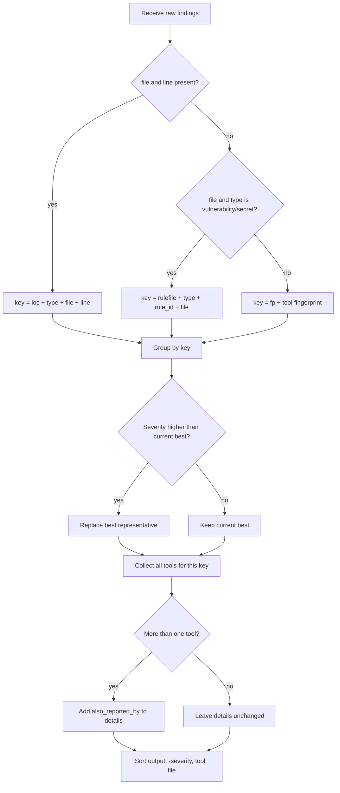

# Aggregator

> Merges every tool's findings for a scan into one deduplicated list, collapsing the same issue reported by multiple tools while preserving every contributing tool name.

## Role in the pipeline

The aggregator sits immediately after the adapters and executor have produced raw `Finding` objects. It takes the combined list from a scan and reduces it so the rest of the pipeline — severity scoring, reporting, and the UI — sees one row per real issue instead of one row per tool per issue. Downstream components consume the deduplicated, worst-first-ordered list it returns.

## How it works

For each finding it builds a `_semantic_key` that is independent of the reporting tool. The preferred key is a location tuple: the finding type, the file, and the line number. This is what lets semgrep and ZAP collapse a single SQLi at `a.py:5` into one record. When a finding has a file but no line — common for SCA CVEs and leaked secrets — the key falls back to `rule_id + file`. Only when there is no usable location at all does it fall back to the raw tool fingerprint, which guarantees that unrelated findings never accidentally merge.

The `deduplicate()` function walks every finding, computes its semantic key, and keeps the single highest-severity representative for that key. All tool names that mapped to the same key are collected. If more than one tool contributed, the representative finding's `details` dict is updated with an `also_reported_by` list. Finally the output is sorted worst-first by severity score, then tool and file, so the most important items appear at the top of a report.

## Code walkthrough

`_semantic_key` chooses the identity tuple:

```python
def _semantic_key(f: Finding) -> Tuple:
    """A location-based identity independent of which tool reported it.
    Falls back to the tool-specific fingerprint when there's no usable location
    (so unrelated findings never collapse together)."""
    if f.file and f.line is not None:
        return ("loc", f.type, f.file, f.line)
    if f.file and f.type in ("vulnerability", "secret"):
        # SCA/secret findings often have no line; rule+file is enough.
        return ("rulefile", f.type, f.rule_id, f.file)
    return ("fp", f.fingerprint)
```

A secret and a SQLi at the same file and line have different `type` values, so they receive different `("loc", ...)` keys. This is intentional: they are different findings and must not merge.

`deduplicate()` performs the collapse, keeps the highest-severity representative, and annotates multi-tool hits:

```python
def deduplicate(findings: List[Finding]) -> List[Finding]:
    """Collapse duplicates, keeping the highest-severity representative and
    annotating it with all contributing tools."""
    best: Dict[Tuple, Finding] = {}
    seen_tools: Dict[Tuple, set] = {}
    for f in findings:
        key = _semantic_key(f)
        seen_tools.setdefault(key, set()).add(f.tool)
        cur = best.get(key)
        if cur is None or f.severity_score > cur.severity_score:
            best[key] = f
    out = []
    for key, f in best.items():
        tools = sorted(seen_tools[key])
        if len(tools) > 1:
            f.details = {**f.details, "also_reported_by": tools}
        out.append(f)
    # stable, worst-first ordering for the UI
    out.sort(key=lambda x: (-x.severity_score, x.tool, x.file or ""))
    return out
```

The module ends with a self-test that demonstrates cross-tool collapse and the severity upgrade:

```python
if __name__ == "__main__":
    from .schema import STATIC, DYNAMIC
    a = Finding(tool="semgrep", pipeline=STATIC, type="sast", severity="high",
                rule_id="sql", message="sqli", file="a.py", line=5)
    b = Finding(tool="zap", pipeline=DYNAMIC, type="sast", severity="critical",
                rule_id="40018", message="sqli", file="a.py", line=5)
    c = Finding(tool="trivy", pipeline=STATIC, type="vulnerability",
                severity="medium", rule_id="CVE-1", message="cve", file="r.txt")
    out = deduplicate([a, b, c])
    assert len(out) == 2, [x.to_dict() for x in out]
    top = out[0]
    assert top.severity == "critical" and "also_reported_by" in top.details
    assert set(top.details["also_reported_by"]) == {"semgrep", "zap"}
    print("dedup self-check passed:", [(x.tool, x.severity, x.details.get('also_reported_by')) for x in out])
```

The self-test creates two SAST findings for the same line and one SCA finding without a line. After deduplication only two records remain; the SQLi is represented by ZAP's critical finding and lists semgrep under `also_reported_by`.

## Diagram



## Key decisions & gotchas

- **Same type only.** The location key includes `type`, so a `secret` and a `sast` finding at the same line never merge. A secret and a SQLi at the same line are different findings and must both be reported.
- **SCA/secret fallback.** CVE and secret scanners often report only a file path. The `rulefile` fallback uses `rule_id + file` so repeated scans of the same dependency still collapse, but unrelated findings in the same file do not.
- **Fingerprint last resort.** When there is no file at all, the key falls back to the tool fingerprint. This prevents unrelated no-location findings from collapsing into one another.
- **Highest severity wins.** The representative finding is whichever tool reported the highest `severity_score`; all other contributors are recorded in `also_reported_by`.
- **Stable worst-first ordering.** The final sort uses `-severity_score` first so the UI shows the most severe issues at the top, with deterministic tie-breaking by tool and file.
- **Idempotent details merge.** `f.details = {**f.details, "also_reported_by": tools}` preserves any existing detail fields rather than overwriting the whole dict.

## Related docs

- [00-overview](00-overview.md) — end-to-end Sentriq flow
- [01-schema](01-schema.md) — `Finding` data model and severity scoring
- [02-adapters](02-adapters.md) — how individual tool outputs become findings
- [03-executor](03-executor.md) — how adapters are run and their outputs combined
- [05-deepseek](05-deepseek.md) — downstream severity analysis that consumes aggregated findings
