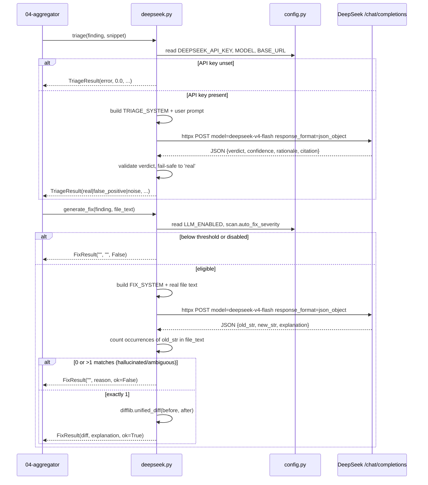

# DeepSeek LLM layer

> Triage and fix-generation layer that calls DeepSeek's OpenAI-compatible endpoint with plain `httpx` to label findings and propose unified-diff patches.

## Role in the pipeline

The aggregator (see `04-aggregator`) emits normalized findings; this layer optionally enriches each finding with an LLM verdict (`real`, `false_positive`, or `noise`) and, for severe enough issues, a suggested code patch. It is a pure enrichment stage: when disabled or unavailable, findings pass through unchanged, and on every failure it returns a safe result rather than crashing the scan.

## How it works

Two public functions are exposed from `ci-utils/sentriq/deepseek.py`: `triage()` and `generate_fix()`. Both build a user prompt from the finding, POST to DeepSeek's `/chat/completions` endpoint in JSON-mode, parse the JSON response, and return dataclasses. `triage()` takes a line-numbered snippet (it cites lines); `generate_fix()` takes the raw file text (it must quote it verbatim).

`LLM_ENABLED` is the master switch. The per-scan `auto_fix_severity` field gates fix generation so the pipeline only burns tokens on serious findings; `"none"` disables patch generation while still triaging every finding. If `DEEPSEEK_API_KEY` is unset, the network call is skipped and a safe error-shaped result is returned.

**The model never authors a diff.** It is asked which text to replace (`old_str`/`new_str`), and `difflib` computes the unified diff against the real file. See _The diff-authoring trap_ under gotchas — this is the single most important thing to know about this module.

## Code walkthrough

The module starts with two result dataclasses:

```python
@dataclass
class TriageResult:
    verdict: str            # real | false_positive | noise | error
    confidence: float       # 0..1
    rationale: str
    citation: Dict[str, Any]


@dataclass
class FixResult:
    diff: str               # unified diff, or "" if none
    explanation: str
    ok: bool
```

The system prompts constrain the model to emit predictable JSON:

```python
TRIAGE_SYSTEM = (
    "You are a senior application-security engineer triaging a static/dynamic "
    "scanner finding. Decide if it is a real exploitable issue, a false "
    "positive, or noise (low-value/informational). Be strict: prefer 'real' "
    "only when the evidence supports exploitability. Respond ONLY as JSON with "
    "keys: verdict (one of 'real','false_positive','noise'), confidence "
    "(0.0-1.0), rationale (<=60 words), citation (object with keys rule, file, "
    "line, why)."
)

FIX_SYSTEM = (
    "You are a secure-coding assistant. Given the contents of a vulnerable file "
    "and a scanner finding, propose the minimal edit that fixes it. Do NOT write "
    "a diff — instead identify the exact text to replace. Respond ONLY as JSON "
    "with keys: old_str (the text to replace, copied VERBATIM from the file "
    "including exact indentation and whitespace; it must appear EXACTLY ONCE in "
    "the file; keep it as short as possible while still unique), new_str (the "
    "replacement text), explanation (<=60 words). If you cannot safely fix it "
    "from the given context, set old_str and new_str to empty strings."
)
```

The shared `_chat()` helper posts via `httpx`, no SDK:

```python
def _chat(system: str, user: str) -> Optional[Dict[str, Any]]:
    if not config.DEEPSEEK_API_KEY:
        logger.warning("DEEPSEEK_API_KEY unset; skipping LLM call")
        return None
    payload = {
        "model": config.DEEPSEEK_MODEL,
        "messages": [
            {"role": "system", "content": system},
            {"role": "user", "content": user},
        ],
        "response_format": {"type": "json_object"},
        "temperature": 0.0,
        "stream": False,
    }
    headers = {"Authorization": f"Bearer {config.DEEPSEEK_API_KEY}",
               "Content-Type": "application/json"}
    url = config.DEEPSEEK_BASE_URL.rstrip("/") + "/chat/completions"
    try:
        resp = httpx.post(url, json=payload, headers=headers,
                          timeout=config.DEEPSEEK_TIMEOUT_SECONDS)
        resp.raise_for_status()
        content = resp.json()["choices"][0]["message"]["content"]
        return json.loads(content)
    except Exception as exc:
        logger.error("deepseek call failed: %s", exc)
        return None
```

The default model is `deepseek-v4-flash`, configured in `config.py`:

```python
DEEPSEEK_API_KEY = os.getenv("DEEPSEEK_API_KEY", "")
DEEPSEEK_BASE_URL = os.getenv("DEEPSEEK_BASE_URL", "https://api.deepseek.com")
# deepseek-v4-flash is the current fast model; legacy deepseek-chat deprecates
# 2026-07-24, so we pin the v4 id.
DEEPSEEK_MODEL = os.getenv("DEEPSEEK_MODEL", "deepseek-v4-flash")
DEEPSEEK_TIMEOUT_SECONDS = int(os.getenv("DEEPSEEK_TIMEOUT_SECONDS", "120"))
# Master switch: when false, triage/fix stages are skipped (findings still
# stored). Lets the pipeline run tool-only without burning tokens.
LLM_ENABLED = os.getenv("LLM_ENABLED", "true").lower() == "true"
# NOTE: the fix-generation severity floor is per-scan (Scan.auto_fix_severity,
# chosen in the UI), not a global env knob.
```

`triage()` parses the verdict and clamps confidence; the fail-safe choice is `real` so a finding is never silently dropped:

```python
def triage(finding: Dict[str, Any], snippet: str = "") -> TriageResult:
    data = _chat(TRIAGE_SYSTEM, _finding_prompt(finding, snippet))
    if not data:
        return TriageResult("error", 0.0, "LLM unavailable", {})
    verdict = str(data.get("verdict", "")).lower().strip()
    if verdict not in _VALID_VERDICTS:
        verdict = "real"  # fail safe: never silently drop a finding
    try:
        conf = float(data.get("confidence", 0.0))
    except (TypeError, ValueError):
        conf = 0.0
    return TriageResult(
        verdict=verdict,
        confidence=max(0.0, min(1.0, conf)),
        rationale=str(data.get("rationale", ""))[:1000],
        citation=data.get("citation") if isinstance(data.get("citation"), dict) else {},
    )
```

`generate_fix()` takes the **full text of the file** and never trusts the model with line arithmetic. It validates that the model's anchor exists exactly once, then builds the patch itself:

```python
    old = str(data.get("old_str") or "")
    new = str(data.get("new_str") or "")
    explanation = str(data.get("explanation", ""))[:1000]

    if not old.strip():
        return FixResult("", explanation or "no fix proposed", False)
    # The anchor must exist verbatim and be unambiguous, else the swap is a
    # guess. Reject rather than emit a patch that corrupts the file.
    occurrences = file_text.count(old)
    if occurrences == 0:
        logger.warning("fix rejected: old_str not found in %s (%s)",
                       path, finding.get("rule_id"))
        return FixResult("", "proposed fix did not match the file", False)
    if occurrences > 1:
        logger.warning("fix rejected: old_str matches %d places in %s",
                       occurrences, path)
        return FixResult("", "proposed fix was ambiguous", False)
    if old == new:
        return FixResult("", explanation or "no change proposed", False)

    diff = _unified_diff(path, file_text, file_text.replace(old, new, 1))
    return FixResult(diff=diff, explanation=explanation, ok=bool(diff.strip()))
```

The uniqueness check is the safety gate: a hallucinated anchor fails closed (`ok=False`) instead of producing a patch that corrupts the file. The diff itself comes from stdlib:

```python
def _unified_diff(path: str, before: str, after: str) -> str:
    """Build a git-applyable unified diff from the real before/after text."""
    diff = "".join(difflib.unified_diff(
        before.splitlines(keepends=True), after.splitlines(keepends=True),
        fromfile=f"a/{path}", tofile=f"b/{path}"))
    return diff if diff.endswith("\n") else diff + "\n"
```

Because `difflib` reads the real file, hunk headers and offsets are correct **by construction** — the class of bug that made every hand-authored patch unusable is now unrepresentable.

`tasks.py` supplies that text via `_read_source()`, which returns the whole file (not a numbered window), and refuses paths that escape the repo:

```python
    path = os.path.join(repo_dir, rel_file)
    # Guard against a tool reporting a path outside the repo (e.g. "../../etc").
    if not os.path.abspath(path).startswith(os.path.abspath(repo_dir) + os.sep):
        logger.warning("refusing to read %s outside repo dir", rel_file)
        return ""
```

Triage still gets the line-numbered snippet from `_context_snippet()` — it cites lines, it never authors a patch.

## Diagram



## Key decisions & gotchas

- **No SDK.** The call uses plain `httpx` against the OpenAI-compatible `/chat/completions` endpoint. This avoids an extra dependency and keeps request/response handling explicit.
- **JSON-mode reliability.** Every request sets `response_format: {"type": "json_object"}` so the model is contractually bound to return parseable JSON.
- **Default model gotcha.** The pinned default is `deepseek-v4-flash`. The legacy ids `deepseek-chat` and `deepseek-reasoner` are scheduled for deprecation on **2026-07-24**, so avoid them in new configuration.
- **The diff-authoring trap (the big one).** The model used to be asked for a unified diff directly. Measured against a real scanned repo, **0 of 18 generated patches applied** — a 100% failure rate. Two compounding causes: SCA findings (trivy) carry `line=None`, so the old `_context_snippet()` returned `""` and the model invented file contents wholesale (it "fixed" a `flask==2.3.2` line in a repo that has no Flask); and even with a snippet, it was line-number-prefixed (`12: code`), so the model had to strip numbers and compute `@@` offsets by hand — it got them wrong. **An LLM cannot reliably count lines. Never ask one for a diff; ask what to change and compute the diff yourself.** After the change: 12/12 regenerated patches apply cleanly.
- **Anchors fail closed.** `old_str` must appear in the file *exactly once*. Zero matches (hallucination) or multiple matches (ambiguity) return `ok=False` rather than a patch that would corrupt the file. A rejected fix is cheap; a bad patch merged into a security PR is not.
- **`file_text` is mandatory for fixes.** With no file text there is nothing to anchor against, so `generate_fix()` returns early *without* calling the LLM — no tokens spent on a guaranteed hallucination.
- **Large files are windowed, but validated whole.** Files over `_MAX_FILE_CHARS` (12k) are windowed around the finding for the prompt, while the uniqueness check and diff still run against the full text.
- **Fail safe on triage.** If the LLM returns an unknown verdict or the call fails, the verdict is forced to `real`. This prevents a finding from being silently dropped.
- **Fail safe on fix.** A missing/empty diff simply yields `ok=False`; the scan continues.
- **Config knobs.** `LLM_ENABLED` skips both stages entirely. Fix cost is gated per-scan by `auto_fix_severity`; `"none"` means *triage only* — it must not skip triage (it once did, which made the AI look dead from the UI).
- **Never raises.** `_chat()` catches `Exception` and returns `None`; both public functions translate that into a safe error result.
- **Version-bump fixes have no live source of truth (found by CodeRabbit, unfixed).** `FIX_SYSTEM` treats every finding the same: "propose the minimal edit." For a dependency-CVE finding (Trivy/`requirements.txt`) the model was asked to name the fixed version, and it named `Django==4.2.15` for CVE-2024-42005 — correct only in the sense that 4.2.15 is *a* version where that changelog entry landed. In reality 4.2.15 already carries dozens of later CVEs and the whole 4.2 line is EOL (final release 4.2.30, April 2026); CodeRabbit's OSV-Scanner pass on the resulting PR flagged it. Root cause: picking a dependency version needs a live, checkable answer (registry/OSV lookup), and an LLM only has a training-data snapshot of one. See [concerns #23](concerns.md#23-ai-picked-fix-versions-have-no-live-source-of-truth).

## Related docs

- [00-overview](00-overview.md) — high-level Sentriq flow
- [04-aggregator](04-aggregator.md) — where normalized findings are produced before triage
- [06-data-model](06-data-model.md) — finding schema consumed by the prompt builder
