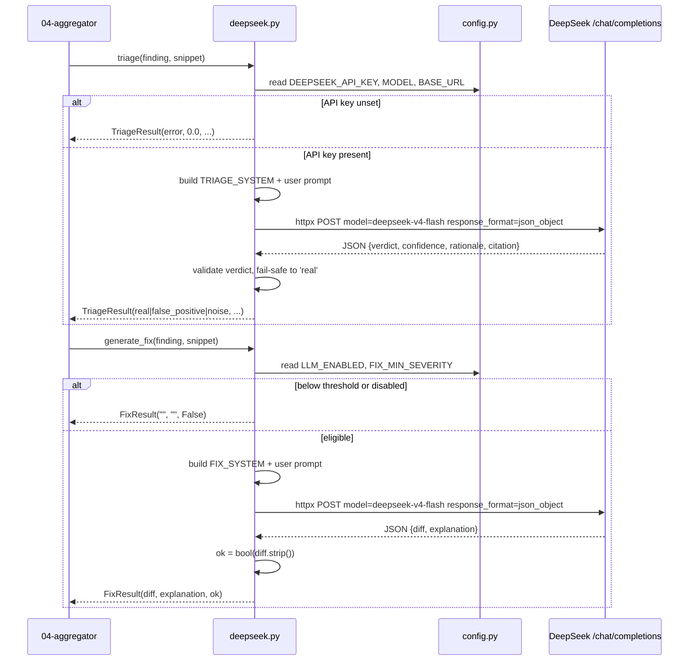

# DeepSeek LLM layer

> Triage and fix-generation layer that calls DeepSeek's OpenAI-compatible endpoint with plain `httpx` to label findings and propose unified-diff patches.

## Role in the pipeline

The aggregator (see `04-aggregator`) emits normalized findings; this layer optionally enriches each finding with an LLM verdict (`real`, `false_positive`, or `noise`) and, for severe enough issues, a suggested code patch. It is a pure enrichment stage: when disabled or unavailable, findings pass through unchanged, and on every failure it returns a safe result rather than crashing the scan.

## How it works

Two public functions are exposed from `ci-utils/sentriq/deepseek.py`: `triage()` and `generate_fix()`. Both build a user prompt from the finding and an optional code snippet, POST to DeepSeek's `/chat/completions` endpoint in JSON-mode, parse the JSON response, and return dataclasses.

`LLM_ENABLED` is the master switch. `FIX_MIN_SEVERITY` (`"high"` by default) gates fix generation so the pipeline only burns tokens on serious findings. If `DEEPSEEK_API_KEY` is unset, the network call is skipped and a safe error-shaped result is returned.

## Code walkthrough

The module starts with two result dataclasses:

```python
@dataclass
class TriageResult:
    verdict: str            # real | false_positive | noise | error
    confidence: float       # 0..1
    rationale: str
    citation: Dict[str, Any]


@dataclass
class FixResult:
    diff: str               # unified diff, or "" if none
    explanation: str
    ok: bool
```

The system prompts constrain the model to emit predictable JSON:

```python
TRIAGE_SYSTEM = (
    "You are a senior application-security engineer triaging a static/dynamic "
    "scanner finding. Decide if it is a real exploitable issue, a false "
    "positive, or noise (low-value/informational). Be strict: prefer 'real' "
    "only when the evidence supports exploitability. Respond ONLY as JSON with "
    "keys: verdict (one of 'real','false_positive','noise'), confidence "
    "(0.0-1.0), rationale (<=60 words), citation (object with keys rule, file, "
    "line, why)."
)

FIX_SYSTEM = (
    "You are a secure-coding assistant. Given a vulnerable code snippet and a "
    "scanner finding, produce a minimal fix as a unified diff (git-style, with "
    "--- a/<file> and +++ b/<file> headers and @@ hunks). Change as little as "
    "possible. If you cannot safely fix it from the given context, return an "
    "empty diff. Respond ONLY as JSON with keys: diff (string, the unified "
    "diff or ''), explanation (<=60 words)."
)
```

The shared `_chat()` helper posts via `httpx`, no SDK:

```python
def _chat(system: str, user: str) -> Optional[Dict[str, Any]]:
    if not config.DEEPSEEK_API_KEY:
        logger.warning("DEEPSEEK_API_KEY unset; skipping LLM call")
        return None
    payload = {
        "model": config.DEEPSEEK_MODEL,
        "messages": [
            {"role": "system", "content": system},
            {"role": "user", "content": user},
        ],
        "response_format": {"type": "json_object"},
        "temperature": 0.0,
        "stream": False,
    }
    headers = {"Authorization": f"Bearer {config.DEEPSEEK_API_KEY}",
               "Content-Type": "application/json"}
    url = config.DEEPSEEK_BASE_URL.rstrip("/") + "/chat/completions"
    try:
        resp = httpx.post(url, json=payload, headers=headers,
                          timeout=config.DEEPSEEK_TIMEOUT_SECONDS)
        resp.raise_for_status()
        content = resp.json()["choices"][0]["message"]["content"]
        return json.loads(content)
    except Exception as exc:
        logger.error("deepseek call failed: %s", exc)
        return None
```

The default model is `deepseek-v4-flash`, configured in `config.py`:

```python
DEEPSEEK_API_KEY = os.getenv("DEEPSEEK_API_KEY", "")
DEEPSEEK_BASE_URL = os.getenv("DEEPSEEK_BASE_URL", "https://api.deepseek.com")
# deepseek-v4-flash is the current fast model; legacy deepseek-chat deprecates
# 2026-07-24, so we pin the v4 id.
DEEPSEEK_MODEL = os.getenv("DEEPSEEK_MODEL", "deepseek-v4-flash")
DEEPSEEK_TIMEOUT_SECONDS = int(os.getenv("DEEPSEEK_TIMEOUT_SECONDS", "120"))
# Master switch: when false, triage/fix stages are skipped (findings still
# stored). Lets the pipeline run tool-only without burning tokens.
LLM_ENABLED = os.getenv("LLM_ENABLED", "true").lower() == "true"
# Only run expensive fix-generation for findings at/above this severity.
FIX_MIN_SEVERITY = os.getenv("FIX_MIN_SEVERITY", "high")
```

`triage()` parses the verdict and clamps confidence; the fail-safe choice is `real` so a finding is never silently dropped:

```python
def triage(finding: Dict[str, Any], snippet: str = "") -> TriageResult:
    data = _chat(TRIAGE_SYSTEM, _finding_prompt(finding, snippet))
    if not data:
        return TriageResult("error", 0.0, "LLM unavailable", {})
    verdict = str(data.get("verdict", "")).lower().strip()
    if verdict not in _VALID_VERDICTS:
        verdict = "real"  # fail safe: never silently drop a finding
    try:
        conf = float(data.get("confidence", 0.0))
    except (TypeError, ValueError):
        conf = 0.0
    return TriageResult(
        verdict=verdict,
        confidence=max(0.0, min(1.0, conf)),
        rationale=str(data.get("rationale", ""))[:1000],
        citation=data.get("citation") if isinstance(data.get("citation"), dict) else {},
    )
```

`generate_fix()` returns the diff plus an `ok` flag that is true only when a non-empty diff was produced:

```python
def generate_fix(finding: Dict[str, Any], snippet: str = "") -> FixResult:
    data = _chat(FIX_SYSTEM, _finding_prompt(finding, snippet))
    if not data:
        return FixResult("", "LLM unavailable", False)
    diff = str(data.get("diff", "") or "")
    return FixResult(diff=diff,
                     explanation=str(data.get("explanation", ""))[:1000],
                     ok=bool(diff.strip()))
```

## Diagram



## Key decisions & gotchas

- **No SDK.** The call uses plain `httpx` against the OpenAI-compatible `/chat/completions` endpoint. This avoids an extra dependency and keeps request/response handling explicit.
- **JSON-mode reliability.** Every request sets `response_format: {"type": "json_object"}` so the model is contractually bound to return parseable JSON.
- **Default model gotcha.** The pinned default is `deepseek-v4-flash`. The legacy ids `deepseek-chat` and `deepseek-reasoner` are scheduled for deprecation on **2026-07-24**, so avoid them in new configuration.
- **Fail safe on triage.** If the LLM returns an unknown verdict or the call fails, the verdict is forced to `real`. This prevents a finding from being silently dropped.
- **Fail safe on fix.** A missing/empty diff simply yields `ok=False`; the scan continues.
- **Config knobs.** `LLM_ENABLED` skips both stages entirely; `FIX_MIN_SEVERITY` limits fix-generation cost.
- **Never raises.** `_chat()` catches `Exception` and returns `None`; both public functions translate that into a safe error result.

## Related docs

- [00-overview](00-overview.md) — high-level Sentriq flow
- [04-aggregator](04-aggregator.md) — where normalized findings are produced before triage
- [06-data-model](06-data-model.md) — finding schema consumed by the prompt builder
