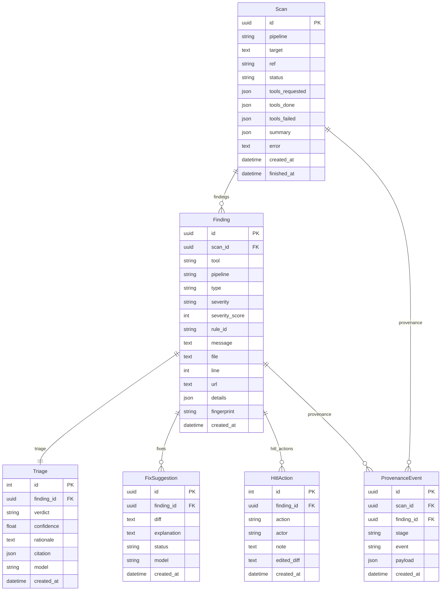

# Postgres data model

> Django models that persist scans, normalized findings, LLM triage, fix suggestions, human-in-the-loop actions, and an append-only audit trail.

## Role in the pipeline

`ci-utils/sentriq/models.py` is the Postgres system of record for Sentriq. The orchestrator creates a `Scan`, adapters/executors write `Finding`s, the triage stage attaches a `Triage` verdict, DeepSeek/fix generation writes `FixSuggestion`s, the HITL gate writes `HitlAction`s, and every stage appends `ProvenanceEvent` rows for observability.

## How it works

A scan is the top-level unit of work. It tracks pipeline kind (`static` or `dynamic`), target, ref, status, tool lists, and a JSON summary. When a scan runs, it produces many `Finding` rows — each mirrors the normalized `schema.Finding` shape with `tool`, `pipeline`, `type`, `severity`, location fields, and a stable `fingerprint`. Findings are ordered by `severity_score`.

Each finding has exactly one `Triage` row (1:1) that stores the LLM verdict (`real`, `false_positive`, `noise`, `error`, or `pending`), confidence, rationale, citation, and model name. A finding may have many `FixSuggestion`s (1:many), each with a `diff`, `explanation`, and status (`proposed`, `approved`, `denied`, `edited`). It may also have many `HitlAction`s (1:many) recording what a human did (`approve`, `deny`, `edit`), who did it, and any edited diff.

`ProvenanceEvent` is the append-only audit log. Each event references a `Scan` and/or a `Finding` (both nullable), names the pipeline `stage`, names the `event`, and stores arbitrary context in `payload`. Callers use `ProvenanceEvent.record()` to insert rows.

## Code walkthrough

The module imports the shared vocabularies from `schema.py` and defines six models:

```python
from .schema import STATIC, DYNAMIC, PIPELINES, SEVERITIES
```

### `Scan`

```python
class Scan(models.Model):
    QUEUED, RUNNING, COMPLETE, PARTIAL, FAILED = (
        "queued", "running", "complete", "partial", "failed")
    STATUS = [(s, s) for s in (QUEUED, RUNNING, COMPLETE, PARTIAL, FAILED)]

    id = models.UUIDField(primary_key=True, default=uuid.uuid4, editable=False)
    pipeline = models.CharField(max_length=10, choices=[(p, p) for p in PIPELINES])
    # git repo url (static) or target url (dynamic)
    target = models.TextField()
    ref = models.CharField(max_length=200, default="HEAD", blank=True)
    status = models.CharField(max_length=12, choices=STATUS, default=QUEUED)
    tools_requested = models.JSONField(default=list)
    tools_done = models.JSONField(default=list)
    tools_failed = models.JSONField(default=list)
    summary = models.JSONField(default=dict, blank=True)
    error = models.TextField(blank=True, default="")
    created_at = models.DateTimeField(auto_now_add=True)
    finished_at = models.DateTimeField(null=True, blank=True)

    class Meta:
        ordering = ["-created_at"]
```

`Scan` represents one CI static or CD dynamic pass. The `status` choices cover the full lifecycle, and `tools_*` JSON arrays track which scanners were requested, finished, or failed. `summary` is the ASPM-style rollup produced by the aggregator.

### `Finding`

```python
class Finding(models.Model):
    id = models.UUIDField(primary_key=True, default=uuid.uuid4, editable=False)
    scan = models.ForeignKey(Scan, related_name="findings", on_delete=models.CASCADE)
    tool = models.CharField(max_length=20)
    pipeline = models.CharField(max_length=10)
    type = models.CharField(max_length=20)
    severity = models.CharField(max_length=10, choices=[(s, s) for s in SEVERITIES])
    severity_score = models.IntegerField(default=0)
    rule_id = models.CharField(max_length=300)
    message = models.TextField()
    file = models.TextField(null=True, blank=True)
    line = models.IntegerField(null=True, blank=True)
    url = models.TextField(null=True, blank=True)
    details = models.JSONField(default=dict, blank=True)
    fingerprint = models.CharField(max_length=200, db_index=True)
    created_at = models.DateTimeField(auto_now_add=True)

    class Meta:
        ordering = ["-severity_score", "tool"]
        indexes = [models.Index(fields=["scan", "severity_score"])]
```

`Finding` mirrors the dataclass in `schema.py`. The `fingerprint` is indexed for deduplication and cross-scan identity, and the composite index on `(scan, severity_score)` supports the API/frontend list view.

### `Triage`

```python
class Triage(models.Model):
    REAL, FALSE_POSITIVE, NOISE, ERROR, PENDING = (
        "real", "false_positive", "noise", "error", "pending")
    VERDICTS = [(v, v) for v in (REAL, FALSE_POSITIVE, NOISE, ERROR, PENDING)]

    finding = models.OneToOneField(Finding, related_name="triage",
                                   on_delete=models.CASCADE)
    verdict = models.CharField(max_length=16, choices=VERDICTS, default=PENDING)
    confidence = models.FloatField(default=0.0)
    rationale = models.TextField(blank=True, default="")
    citation = models.JSONField(default=dict, blank=True)
    model = models.CharField(max_length=60, blank=True, default="")
    created_at = models.DateTimeField(auto_now_add=True)
```

`Triage` is the LLM verdict for a finding. The 1:1 relationship from `Finding` means `finding.triage` always resolves to a single record; cascade delete keeps the two in sync.

### `FixSuggestion`

```python
class FixSuggestion(models.Model):
    PROPOSED, APPROVED, DENIED, EDITED = "proposed", "approved", "denied", "edited"
    STATUS = [(s, s) for s in (PROPOSED, APPROVED, DENIED, EDITED)]

    id = models.UUIDField(primary_key=True, default=uuid.uuid4, editable=False)
    finding = models.ForeignKey(Finding, related_name="fixes",
                                on_delete=models.CASCADE)
    diff = models.TextField(blank=True, default="")
    explanation = models.TextField(blank=True, default="")
    status = models.CharField(max_length=10, choices=STATUS, default=PROPOSED)
    model = models.CharField(max_length=60, blank=True, default="")
    created_at = models.DateTimeField(auto_now_add=True)
```

A finding may have zero or many fix suggestions. `status` tracks whether the suggestion is still proposed or has been acted on by the HITL gate.

### `HitlAction`

```python
class HitlAction(models.Model):
    APPROVE, DENY, EDIT = "approve", "deny", "edit"
    ACTIONS = [(a, a) for a in (APPROVE, DENY, EDIT)]

    finding = models.ForeignKey(Finding, related_name="hitl_actions",
                                on_delete=models.CASCADE)
    action = models.CharField(max_length=10, choices=ACTIONS)
    actor = models.CharField(max_length=120, default="anonymous")
    note = models.TextField(blank=True, default="")
    edited_diff = models.TextField(null=True, blank=True)
    created_at = models.DateTimeField(auto_now_add=True)
```

`HitlAction` records every human decision at the gate. `edited_diff` is populated only for `edit` actions; otherwise it may be `NULL`.

### `ProvenanceEvent`

```python
class ProvenanceEvent(models.Model):
    """Append-only audit trail. Every pipeline stage writes here."""
    SCAN, NORMALIZE, TRIAGE, FIX, HITL = (
        "scan", "normalize", "triage", "fix", "hitl")

    id = models.UUIDField(primary_key=True, default=uuid.uuid4, editable=False)
    scan = models.ForeignKey(Scan, related_name="provenance", null=True,
                             blank=True, on_delete=models.CASCADE)
    finding = models.ForeignKey(Finding, related_name="provenance", null=True,
                                blank=True, on_delete=models.CASCADE)
    stage = models.CharField(max_length=20)
    event = models.CharField(max_length=120)
    payload = models.JSONField(default=dict, blank=True)
    created_at = models.DateTimeField(auto_now_add=True)

    class Meta:
        ordering = ["created_at"]

    @classmethod
    def record(cls, stage, event, scan=None, finding=None, **payload):
        return cls.objects.create(stage=stage, event=event, scan=scan,
                                  finding=finding, payload=payload)
```

`ProvenanceEvent.record()` is the only intended write path. It accepts a stage name, event name, optional scan/finding, and any extra keyword arguments are folded into the JSON `payload`. Events are ordered by creation time and never updated.

## Diagram



## Key decisions & gotchas

- **Cascading deletes everywhere.** Deleting a `Scan` cascades to its `Finding`s, and deleting a `Finding` cascades to its `Triage`, `FixSuggestion`s, `HitlAction`s, and `ProvenanceEvent`s. This matches the "scan is the unit of retention" design.
- **Finding mirrors `schema.Finding`.** Keep the Django model and the dataclass in sync; adapters depend only on the dataclass, while the rest of the system reads the model.
- **Verdict default is `pending`.** Until the triage stage runs, every `Finding` has a `Triage` row with `verdict="pending"`.
- **`ProvenanceEvent` is append-only.** Use `record()`; do not update existing rows. The nullable `scan`/`finding` FKs let a single event describe either a scan-level milestone or a finding-level transition.
- **No `unique_together` on `Finding.fingerprint`.** The fingerprint is indexed but not unique within a scan so that repeated issues can be recorded and resolved independently.

## Related docs

- [00-overview](00-overview.md)
- [01-schema](01-schema.md)
- [02-adapters](02-adapters.md)
- [03-executor](03-executor.md)
- [04-aggregator](04-aggregator.md)
- [05-deepseek](05-deepseek.md)
- [07-orchestration](07-orchestration.md)
- [08-api](08-api.md)
- [09-frontend](09-frontend.md)
- [10-deployment](10-deployment.md)
