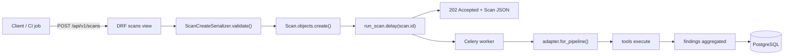

# HTTP API (DRF)

> The public REST surface for submitting scans, reviewing findings, gating fix suggestions via human-in-the-loop, and reading ASPM-style metrics.

## Role in the pipeline

The API lives at `/api/v1/` and is mounted by `ci-utils/ciutils/urls.py`. CI jobs and the web frontend call it to enqueue new scans, poll scan status, and fetch the findings produced by the executor/aggregator. The HITL endpoint is the only path that mutates triage state after a scan has finished.

## How it works

All endpoints are plain Django REST Framework function-based views decorated with `@api_view`. They serialize model instances from the `sentriq` app and return JSON.

### Endpoint table

| Method | Path | Purpose | Key query params / body |
|--------|------|---------|-------------------------|
| GET | `/api/v1/health` | Liveness probe | — |
| GET | `/api/v1/scans` | List recent scans | `?pipeline=` |
| POST | `/api/v1/scans` | Submit a new scan | `{pipeline, target, ref?}` |
| GET | `/api/v1/scans/<uuid:scan_id>` | Scan detail | — |
| GET | `/api/v1/findings` | List findings | `?severity=&tool=&type=&pipeline=&verdict=&scan=` |
| GET | `/api/v1/findings/<uuid:finding_id>` | Finding detail with triage, fixes, HITL | — |
| POST | `/api/v1/findings/<uuid:finding_id>/hitl` | Approve / deny / edit a fix | `{action, actor?, note?, edited_diff?}` |
| GET | `/api/v1/provenance` | Audit log | `?scan=`, `?finding=` |
| GET | `/api/v1/metrics` | ASPM rollup | — |

### Examples

#### POST /api/v1/scans

Request:

```json
{
  "pipeline": "static",
  "target": "https://github.com/acme/webapp",
  "ref": "main"
}
```

Response (202 Accepted):

```json
{
  "id": "a1b2c3d4-e5f6-7890-abcd-ef1234567890",
  "pipeline": "static",
  "target": "https://github.com/acme/webapp",
  "ref": "main",
  "status": "pending",
  "tools_requested": [],
  "tools_done": [],
  "tools_failed": [],
  "summary": null,
  "error": null,
  "created_at": "2026-07-14T09:30:00Z",
  "finished_at": null,
  "finding_count": 0
}
```

#### GET /api/v1/findings?severity=critical&verdict=confirmed

Response:

```json
[
  {
    "id": "f1b2c3d4-e5f6-7890-abcd-ef1234567891",
    "tool": "semgrep",
    "pipeline": "static",
    "type": "sql-injection",
    "severity": "critical",
    "severity_score": 9.5,
    "rule_id": "python.sql-injection.crs-001",
    "message": "User input reaches SQL query",
    "file": "src/store.py",
    "line": 42,
    "url": null,
    "fingerprint": "semgrep:python.sql-injection.crs-001:src/store.py:42",
    "verdict": "confirmed",
    "has_fix": true
  }
]
```

#### POST /api/v1/findings/<id>/hitl

Request:

```json
{
  "action": "approve",
  "actor": "alice@example.com",
  "note": "Diff looks correct, tests pass"
}
```

Response (201 Created):

```json
{
  "status": "recorded",
  "action": "approve"
}
```

For `edit`, include `edited_diff` to overwrite the latest `FixSuggestion.diff`:

```json
{
  "action": "edit",
  "actor": "bob@example.com",
  "note": "Use parameterized query instead",
  "edited_diff": "--- a/src/store.py\n+++ b/src/store.py\n@@ -42 +42 @@\n-cursor.execute(query)\n+cursor.execute(query, params)\n"
}
```

#### GET /api/v1/metrics

Response:

```json
{
  "totals": {
    "scans": 12,
    "findings": 87,
    "fixes_proposed": 64,
    "fixes_approved": 31
  },
  "by_severity": {
    "critical": 4,
    "high": 21,
    "medium": 38,
    "low": 24
  },
  "by_tool": {
    "semgrep": 45,
    "zap": 42
  },
  "by_type": {
    "sql-injection": 7,
    "xss": 15
  },
  "by_verdict": {
    "confirmed": 20,
    "false_positive": 12,
    "needs_review": 5,
    "untriaged": 50
  },
  "scans_by_status": {
    "completed": 10,
    "failed": 2
  }
}
```

## Code walkthrough

The URL router mounts the whole app under `/api/v1/`:

```python
from django.urls import include, path

urlpatterns = [
    path("api/v1/", include("sentriq.urls")),
]
```

The app-level routes are all function views:

```python
urlpatterns = [
    path("health", views.health),
    path("scans", views.scans),
    path("scans/<uuid:scan_id>", views.scan_detail),
    path("findings", views.findings),
    path("findings/<uuid:finding_id>", views.finding_detail),
    path("findings/<uuid:finding_id>/hitl", views.finding_hitl),
    path("provenance", views.provenance),
    path("metrics", views.metrics),
]
```

### Scan submission

`ScanCreateSerializer` validates the pipeline choice and, for dynamic scans, that the target is an HTTP(S) URL:

```python
class ScanCreateSerializer(serializers.Serializer):
    pipeline = serializers.ChoiceField(choices=[STATIC, DYNAMIC])
    target = serializers.CharField()          # repo url (static) | target url (dynamic)
    ref = serializers.CharField(required=False, default="HEAD", allow_blank=True)

    def validate(self, attrs):
        if attrs["pipeline"] == DYNAMIC and not attrs["target"].startswith(("http://", "https://")):
            raise serializers.ValidationError(
                "dynamic scan target must be an http(s) URL")
        return attrs
```

The `scans` view creates a `Scan`, enqueues `run_scan.delay(...)`, and returns `202 Accepted`:

```python
@api_view(["GET", "POST"])
def scans(request):
    if request.method == "POST":
        ser = ScanCreateSerializer(data=request.data)
        ser.is_valid(raise_exception=True)
        d = ser.validated_data
        scan = Scan.objects.create(pipeline=d["pipeline"], target=d["target"],
                                   ref=d.get("ref") or "HEAD")
        # enqueue async; import here to avoid a hard Celery import on read paths
        from .tasks import run_scan
        run_scan.delay(str(scan.id))
        logger.info("queued %s scan %s target=%s", d["pipeline"], scan.id,
                    d["target"])
        return Response(ScanSerializer(scan).data, status=status.HTTP_202_ACCEPTED)

    qs = Scan.objects.all()
    pipeline = request.query_params.get("pipeline")
    if pipeline:
        qs = qs.filter(pipeline=pipeline)
    return Response(ScanSerializer(qs[:100], many=True).data)
```

### Finding serializers

List findings are lightweight and include a computed `verdict` and `has_fix`:

```python
class FindingListSerializer(serializers.ModelSerializer):
    verdict = serializers.SerializerMethodField()
    has_fix = serializers.SerializerMethodField()

    class Meta:
        model = Finding
        fields = ["id", "tool", "pipeline", "type", "severity", "severity_score",
                  "rule_id", "message", "file", "line", "url", "fingerprint",
                  "verdict", "has_fix"]

    def get_verdict(self, obj):
        t = getattr(obj, "triage", None)
        return t.verdict if t else None

    def get_has_fix(self, obj):
        return obj.fixes.exists()
```

The detail serializer embeds `triage`, `fixes`, and `hitl_actions`:

```python
class FindingDetailSerializer(serializers.ModelSerializer):
    triage = TriageSerializer(read_only=True)
    fixes = FixSuggestionSerializer(many=True, read_only=True)
    hitl_actions = HitlActionSerializer(many=True, read_only=True)

    class Meta:
        model = Finding
        fields = ["id", "scan", "tool", "pipeline", "type", "severity",
                  "severity_score", "rule_id", "message", "file", "line", "url",
                  "details", "fingerprint", "created_at", "triage", "fixes",
                  "hitl_actions"]
```

### Filtering findings

The list endpoint applies optional exact-match filters and limits results to 500:

```python
@api_view(["GET"])
def findings(request):
    qs = Finding.objects.select_related("triage").prefetch_related("fixes")
    for field in ("severity", "tool", "type", "pipeline"):
        val = request.query_params.get(field)
        if val:
            qs = qs.filter(**{field: val})
    scan_id = request.query_params.get("scan")
    if scan_id:
        qs = qs.filter(scan_id=scan_id)
    verdict = request.query_params.get("verdict")
    if verdict:
        qs = qs.filter(triage__verdict=verdict)
    return Response(FindingListSerializer(qs[:500], many=True).data)
```

### HITL gate

`finding_hitl` records a human decision, advances the most recent `FixSuggestion` status, and writes a provenance event:

```python
@api_view(["POST"])
def finding_hitl(request, finding_id):
    """Human approve / deny / edit on a finding's fix. Writes provenance and
    advances the latest FixSuggestion's status."""
    try:
        f = Finding.objects.get(id=finding_id)
    except Finding.DoesNotExist:
        return Response({"detail": "not found"}, status=status.HTTP_404_NOT_FOUND)
    ser = HitlCreateSerializer(data=request.data)
    ser.is_valid(raise_exception=True)
    d = ser.validated_data

    action = HitlAction.objects.create(
        finding=f, action=d["action"], actor=d.get("actor", "anonymous"),
        note=d.get("note", ""), edited_diff=d.get("edited_diff"))

    fix = f.fixes.first()  # most recent (ordering = -created_at)
    if fix:
        fix.status = {HitlAction.APPROVE: FixSuggestion.APPROVED,
                      HitlAction.DENY: FixSuggestion.DENIED,
                      HitlAction.EDIT: FixSuggestion.EDITED}[d["action"]]
        if d["action"] == HitlAction.EDIT and d.get("edited_diff"):
            fix.diff = d["edited_diff"]
        fix.save(update_fields=["status", "diff"])

    ProvenanceEvent.record(ProvenanceEvent.HITL, f"hitl {d['action']}",
                           scan=f.scan, finding=f, actor=d.get("actor"),
                           note=d.get("note", ""))
    return Response({"status": "recorded", "action": d["action"]},
                    status=status.HTTP_201_CREATED)
```

`HitlCreateSerializer` only exposes the fields clients should send:

```python
class HitlCreateSerializer(serializers.Serializer):
    action = serializers.ChoiceField(choices=[HitlAction.APPROVE, HitlAction.DENY,
                                              HitlAction.EDIT])
    actor = serializers.CharField(required=False, default="anonymous")
    note = serializers.CharField(required=False, allow_blank=True, default="")
    edited_diff = serializers.CharField(required=False, allow_blank=True,
                                        allow_null=True, default=None)
```

### Provenance and metrics

The provenance endpoint filters by `scan` or `finding` and caps at 500 rows:

```python
@api_view(["GET"])
def provenance(request):
    qs = ProvenanceEvent.objects.all()
    scan_id = request.query_params.get("scan")
    if scan_id:
        qs = qs.filter(scan_id=scan_id)
    finding_id = request.query_params.get("finding")
    if finding_id:
        qs = qs.filter(finding_id=finding_id)
    return Response(ProvenanceSerializer(qs[:500], many=True).data)
```

The metrics view aggregates findings by severity, tool, type, and verdict, plus scan/fix counts:

```python
@api_view(["GET"])
def metrics(request):
    """ASPM risk-posture rollup across all findings."""
    all_findings = Finding.objects.all()
    by_sev = {s: 0 for s in SEVERITIES}
    for row in all_findings.values("severity").annotate(n=Count("id")):
        by_sev[row["severity"]] = row["n"]
    by_tool = {r["tool"]: r["n"]
               for r in all_findings.values("tool").annotate(n=Count("id"))}
    by_type = {r["type"]: r["n"]
               for r in all_findings.values("type").annotate(n=Count("id"))}
    by_verdict = {r["triage__verdict"] or "untriaged": r["n"]
                  for r in all_findings.values("triage__verdict").annotate(n=Count("id"))}
    scans_qs = Scan.objects.all()
    return Response({
        "totals": {
            "scans": scans_qs.count(),
            "findings": all_findings.count(),
            "fixes_proposed": FixSuggestion.objects.count(),
            "fixes_approved": FixSuggestion.objects.filter(
                status=FixSuggestion.APPROVED).count(),
        },
        "by_severity": by_sev,
        "by_tool": by_tool,
        "by_type": by_type,
        "by_verdict": by_verdict,
        "scans_by_status": {
            r["status"]: r["n"]
            for r in scans_qs.values("status").annotate(n=Count("id"))},
    })
```

## Diagram

### Scan-submit request path



## Key decisions & gotchas

- Function-based views are used throughout; no ViewSets or routers, so each path is explicit in `urls.py`.
- `run_scan` is imported inside the `POST` branch so that importing `views.py` on read-only paths does not require Celery to be available.
- `ScanCreateSerializer` is a plain `Serializer`, not a `ModelSerializer`, because it accepts `pipeline`/`target` and derives the `ref` default before creation.
- Findings are capped at 500 rows and scans at 100; clients should use filters rather than expecting full unbounded dumps.
- `finding_hitl` only touches `f.fixes.first()`. Earlier suggestions are left untouched, so the most recent suggestion is the one whose status reflects the HITL decision.
- `metrics` is computed on demand across the whole table; it has no caching or pagination.
- The API currently has no authentication/authorization decorators in the quoted source.

## Related docs

- [00-overview](00-overview.md) — Sentriq system overview
- [01-schema](01-schema.md) — finding schema definitions
- [02-adapters](02-adapters.md) — pipeline adapters used during scan execution
- [03-executor](03-executor.md) — how `run_scan` executes tools
- [04-aggregator](04-aggregator.md) — finding aggregation and deduplication
- [06-data-model](06-data-model.md) — the models serialized by this API
- [07-orchestration](07-orchestration.md) — Celery task orchestration behind `run_scan.delay`
