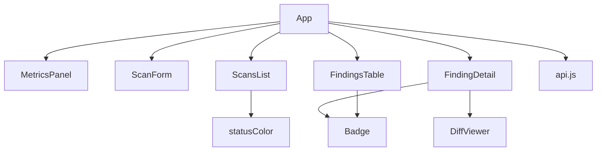
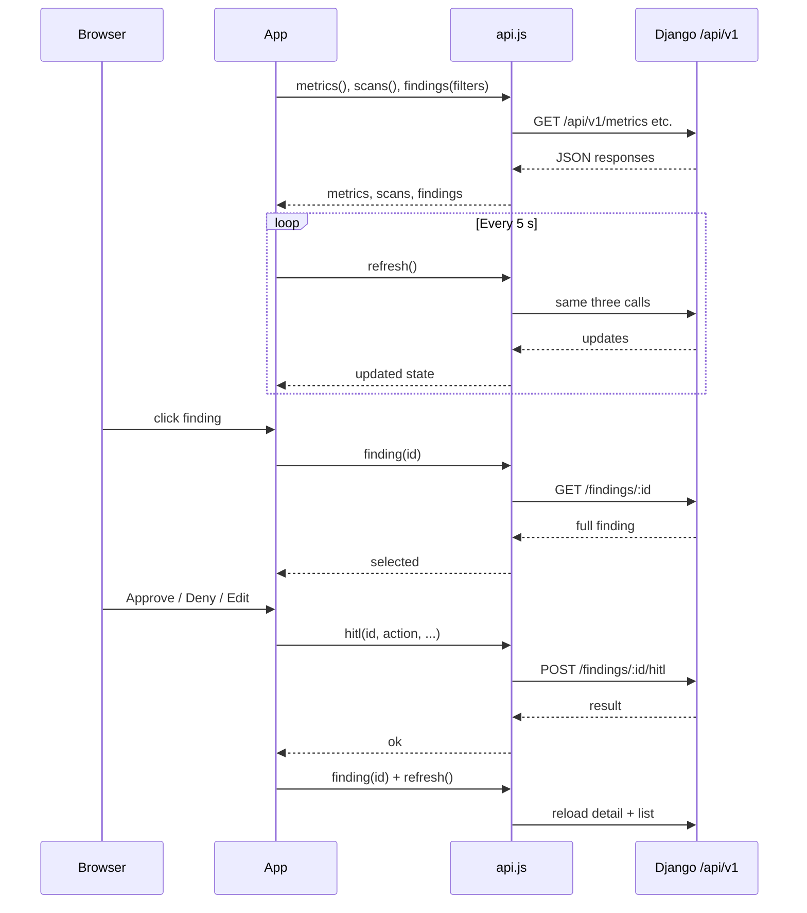

# React Frontend

> Single-page React dashboard that lets users create scans, watch results arrive, inspect findings, and approve or deny AI-generated fixes.

## Role in the pipeline

The frontend is the human-facing layer of Sentriq. It sits in front of the Django API documented in `08-api.md`, rendering scans, findings, and fixes produced by the orchestrator (`07-orchestration.md`) and the DeepSeek triage/fix generator (`05-deepseek.md`). Operators use it to filter findings, open a detail drawer, and pass or fail proposed fixes through the HITL gate.

## How it works

`App.jsx` owns all global state — metrics, scans, findings, filters, and the selected finding — and refreshes it every five seconds. On mount and whenever filters change it calls `api.metrics()`, `api.scans()`, and `api.findings(filters)` in parallel; a `setInterval` keeps polling while the page is open.

The UI is split into a top bar, a metrics row, a two-column grid, and an overlay drawer. The left column contains `ScanForm` and `ScansList`; the right column shows `FindingsTable`. Clicking a scan filters the findings; clicking a finding opens `FindingDetail`. Inside the drawer, `DiffViewer` renders the unified diff from the proposed fix, and the HITL buttons call `api.hitl()` to record a human verdict. After any HITL action the parent reloads the selected finding and refreshes the list so counts and badges update.

`api.js` is a thin `fetch` wrapper that talks to `/api/v1`. In development Vite proxies `/api` to the backend at `localhost:8080` (or `VITE_API_PROXY`) so the browser stays on one origin; in production the same-host bundle relies on nginx or `VITE_API_BASE`.

## Code walkthrough

### App.jsx — state and polling

```jsx
const POLL_MS = 5000;

export default function App() {
  const [metrics, setMetrics] = useState(null);
  const [scans, setScans] = useState([]);
  const [findings, setFindings] = useState([]);
  const [filters, setFilters] = useState({ scan: "", severity: "", tool: "", verdict: "" });
  const [selected, setSelected] = useState(null);   // finding detail (full object)
  const [busy, setBusy] = useState(false);
  const [err, setErr] = useState(null);
```

`App` keeps the dashboard state. `filters` drives the `/findings` query; `selected` holds the full finding object shown in the drawer.

```jsx
  const refresh = useCallback(async () => {
    try {
      const [m, s, f] = await Promise.all([
        api.metrics(), api.scans(), api.findings(filters),
      ]);
      setMetrics(m); setScans(s); setFindings(f); setErr(null);
    } catch (e) {
      setErr(e.message);
    }
  }, [filters]);

  useEffect(() => { refresh(); }, [refresh]);
  useEffect(() => {
    const t = setInterval(refresh, POLL_MS);
    return () => clearInterval(t);
  }, [refresh]);
```

`refresh` fetches three endpoints in parallel whenever filters change, and the interval re-runs it every 5 seconds so scans, findings, and metrics stay live.

```jsx
  const openFinding = async (id) => {
    try { setSelected(await api.finding(id)); }
    catch (e) { setErr(e.message); }
  };

  const doHitl = async (id, action, note) => {
    await api.hitl(id, action, "reviewer", note, null);
    await openFinding(id);   // reload detail
    refresh();
  };
```

`openFinding` fetches one finding by id into the drawer. `doHitl` posts a review action, reloads the detail to show the new state, and refreshes the list.

### api.js — thin same-origin client

```jsx
const BASE = (import.meta.env.VITE_API_BASE || "") + "/api/v1";

async function req(path, opts = {}) {
  const res = await fetch(BASE + path, {
    headers: { "Content-Type": "application/json" },
    ...opts,
  });
  if (!res.ok) {
    const body = await res.text();
    throw new Error(`${res.status} ${path}: ${body}`);
  }
  return res.status === 204 ? null : res.json();
}
```

The client uses same-origin `/api/v1` by default and JSON bodies. Errors surface the HTTP status and response text.

```jsx
export const api = {
  createScan: (pipeline, target, ref) =>
    req("/scans", { method: "POST", body: JSON.stringify({ pipeline, target, ref }) }),
  scans: () => req("/scans"),
  scan: (id) => req(`/scans/${id}`),
  findings: (params = {}) => {
    const q = new URLSearchParams(Object.entries(params).filter(([, v]) => v)).toString();
    return req("/findings" + (q ? `?${q}` : ""));
  },
  finding: (id) => req(`/findings/${id}`),
  hitl: (id, action, actor, note, edited_diff) =>
    req(`/findings/${id}/hitl`, {
      method: "POST",
      body: JSON.stringify({ action, actor, note, edited_diff }),
    }),
  metrics: () => req("/metrics"),
```

Endpoints map directly to `08-api.md`: scans, filtered findings, single finding, HITL, and metrics. `findings` strips empty filters before building the query string.

### vite.config.js — dev proxy / single-origin

```jsx
export default defineConfig({
  plugins: [react()],
  server: {
    host: true,
    port: 3000,
    proxy: {
      "/api": {
        target: process.env.VITE_API_PROXY || "http://localhost:8080",
        changeOrigin: true,
      },
    },
  },
});
```

In development the Vite server serves the React app on port 3000 and forwards `/api` requests to the Django backend. This avoids CORS and mirrors the production single-origin layout.

### Badge.jsx — severity / verdict / tool chips

```jsx
export function SeverityBadge({ severity }) {
  return <span className={`badge sev-${severity}`}>{severity}</span>;
}

export function VerdictBadge({ verdict }) {
  const v = verdict || "pending";
  const label = v === "false_positive" ? "false pos" : v;
  return <span className={`badge v-${v}`}>{label}</span>;
}
```

Small presentational components used by `FindingsTable` and `FindingDetail`. `VerdictBadge` normalises missing verdicts to `pending` and shortens `false_positive` for display.

### MetricsPanel.jsx — top-level counters

```jsx
const SEV_ORDER = ["critical", "high", "medium", "low", "info"];
const SEV_VAR = {
  critical: "var(--crit)", high: "var(--high)", medium: "var(--med)",
  low: "var(--low)", info: "var(--info)",
};
```

Renders the totals tile and a stacked severity bar using CSS variables. It is read-only; `App` passes the `/metrics` response.

### ScanForm.jsx — create a scan

```jsx
const submit = (e) => {
  e.preventDefault();
  if (!target.trim()) return;
  onSubmit(pipeline, target.trim(), ref.trim() || "HEAD");
};
```

A controlled form with a pipeline selector and target/ref inputs. Static scans ask for a git repo and ref; dynamic scans ask for a target URL.

### ScansList.jsx — recent scans sidebar

```jsx
export default function ScansList({ scans, onPick, activeScan }) {
  if (!scans.length) return <div className="spinner">No scans yet.</div>;
  return (
    <div>
      {scans.map((s) => (
        <div key={s.id} className="scan-row" onClick={() => onPick(s.id)}
          style={activeScan === s.id ? { color: "var(--accent)" } : undefined}>
          <div className="t" title={s.target}>
            <span className="badge tool" style={{ marginRight: 6 }}>{s.pipeline}</span>
            {s.target.replace(/^https?:\/\//, "")}
          </div>
          <div className="s" style={{ color: statusColor(s.status) }}>
            {s.status} · {s.finding_count}
          </div>
        </div>
      ))}
    </div>
  );
}
```

Lists scans with a coloured status dot and finding count. Clicking toggles the scan filter in `App`.

### FindingsTable.jsx — filterable findings grid

```jsx
const set = (k) => (e) => setFilters({ ...filters, [k]: e.target.value });
```

Three dropdowns update the `filters` state held by `App`. The table row highlights the selected finding and calls `onPick` to open the detail drawer.

```jsx
<tr key={f.id} className={`f-row ${selected === f.id ? "sel" : ""}`}
  onClick={() => onPick(f.id)}>
  <td><SeverityBadge severity={f.severity} /></td>
  <td><ToolBadge tool={f.tool} /></td>
  <td>{f.message}<div className="file mono">{f.rule_id}</div></td>
  <td className="mono file">
    {f.file ? (f.line ? `${f.file}:${f.line}` : f.file) : "—"}
  </td>
  <td><VerdictBadge verdict={f.verdict} /></td>
  <td>{f.has_fix ? <span className="fix-dot">●</span> : ""}</td>
</tr>
```

Each row shows severity, tool, message, rule id, file/line, verdict, and whether a fix exists.

### FindingDetail.jsx — drawer with HITL actions

```jsx
const fix = finding.fixes && finding.fixes[0];
const triage = finding.triage;

const act = async (action) => {
  setBusy(true);
  try {
    await onHitl(finding.id, action, note);
  } finally {
    setBusy(false);
  }
};
```

The drawer takes the first fix and the triage block. `act` invokes the parent HITL handler with the current note and action.

```jsx
<div className="hitl-actions">
  <button className="ok" disabled={busy} onClick={() => act("approve")}>Approve</button>
  <button className="danger" disabled={busy} onClick={() => act("deny")}>Deny</button>
  <button className="ghost" disabled={busy} onClick={() => act("edit")}>Mark edited</button>
</div>
```

Three possible verdicts: `approve`, `deny`, and `edit`. `edit` records that a human modified the proposed diff before accepting.

### DiffViewer.jsx — unified-diff renderer

```jsx
const lines = diff.split("\n");
return (
  <pre className="diff">
    {lines.map((ln, i) => {
      let cls = "";
      if (ln.startsWith("+++") || ln.startsWith("---") || ln.startsWith("diff ")) cls = "meta";
      else if (ln.startsWith("@@")) cls = "hunk";
      else if (ln.startsWith("+")) cls = "add";
      else if (ln.startsWith("-")) cls = "del";
      return <span key={i} className={`ln ${cls}`}>{ln || " "}</span>;
    })}
  </pre>
);
```

Parses the raw diff string line by line, classifies file meta lines, hunk headers, additions, and deletions, and renders them with CSS classes. Empty lines are replaced by a space so the `span` does not collapse.

## Diagram

### Component tree



### Data flow



## Key decisions & gotchas

- **Single source of truth**: `App` owns all state; child components receive props and callbacks. This keeps the polling logic in one place.
- **Polling is cheap but not reactive**: the dashboard refreshes every 5 seconds. For very large findings lists this may become noisy; future work could move to websockets or server-sent events.
- **HITL reload round-trip**: after a review action, `doHitl` waits for `openFinding(id)` and then calls `refresh()`. If either call fails the error surfaces in `App`'s `err` banner.
- **DiffViewer is minimal**: it classifies lines by prefix only. It does not apply patches, compute side-by-side views, or render intra-line changes.
- **Same-origin by default**: production assumes nginx serves both the built React bundle and the Django API from the same host. Use `VITE_API_BASE` only when cross-origin is unavoidable.
- **The `edit` action**: `FindingDetail` passes `null` for `edited_diff`. If the operator actually edits the patch in the UI, the field would need to be wired through the note area or a dedicated editor.

## Related docs

- [00-overview.md](./00-overview.md) — what Sentriq does end to end
- [05-deepseek.md](./05-deepseek.md) — how fixes and triage are generated
- [07-orchestration.md](./07-orchestration.md) — background scan orchestrator that produces the data shown here
- [08-api.md](./08-api.md) — backend endpoints consumed by `api.js`
- [10-deployment.md](./10-deployment.md) — nginx and container layout that serves the built frontend
