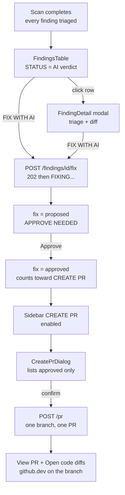

# React Frontend

> React/Vite dashboard where a human reads triaged findings, asks the AI for a fix on the ones that matter, approves what they trust, and ships the approved set as one pull request.

## Role in the pipeline

The frontend sits in front of the DRF API (`08-api.md`) and renders what the orchestrator (`07-orchestration.md`) and the DeepSeek layer (`05-deepseek.md`) produce. It is the **consent layer** of the pipeline: the backend never writes a patch or opens a PR by itself, so every remediation passes through two deliberate clicks here — *Fix with AI*, then *Approve*.

## How it works

`App.jsx` holds the dashboard state and polls the API every 3s. The sidebar switches a `tab` between four panels — dashboard (metrics + queue + findings), scan config, recent scans, assets. The finding detail is a centered modal, not a route.

The remediation flow is opt-in at every step:

1. A scan triages **every** finding (`auto_fix_severity` defaults to `"none"`), so the STATUS column shows the AI verdict — `real`, `false positive`, `noise` — and nothing is patched.
2. The FIX column offers **FIX WITH AI** per finding. Clicking it `POST`s `/findings/{id}/fix`; the row shows `FIXING…` until a fix appears in the polled list.
3. Once a fix exists the cell reads **APPROVE NEEDED**. Clicking approves it (`POST /findings/{id}/hitl`) and the cell becomes `✓ APPROVED`.
4. **CREATE PR** in the sidebar stays disabled until at least one fix is approved. It opens `CreatePrDialog`, which lists exactly the approved fixes and states that nothing else is included, then posts `/pr` for the batch.

## Code walkthrough

Selection is an **id**, never an object — load-bearing, not a style choice:

```jsx
  // Only the id is selection state. The detail object is fetched from it, so a
  // late/stale response can never resurrect a closed or replaced dialog.
  const [selectedId, setSelectedId] = useState(null);
  const [detail, setDetail] = useState(null);
```

The detail is fetched by an effect owned by `selectedId` and guarded by `alive`:

```jsx
  useEffect(() => {
    if (!selectedId) {
      setDetail(null);
      return;
    }
    let alive = true;
    // Switching rows: drop the previous row's data immediately so it can never
    // flash in the new dialog. Same id (the 3s poll) keeps it — no flicker.
    setDetail((cur) => (cur?.id === selectedId ? cur : null));
    const load = async () => {
      try {
        const d = await api.findings.get(selectedId);
        if (alive) setDetail(d);
      } catch (e) {
        if (alive) setErr(e.message);
      }
    };
    load();
    // Keep the open finding live (triage/fix land asynchronously mid-scan).
    const t = setInterval(load, POLL_MS);
    return () => {
      alive = false;
      clearInterval(t);
    };
  }, [selectedId]);
```

`refresh()` deliberately does **not** touch selection state:

```jsx
    // NB: never write selection state here. The list rows come from
    // FindingListSerializer, which has no `triage`/`details` — merging one into
    // the open dialog is what made a triaged finding read "Not triaged yet".
  }, [selectedRepo, filters]);
```

Only approved fixes are PR candidates, and the button is gated on that — not on a fix merely existing:

```jsx
  // Every approved fix for this repo that has not already gone into a PR.
  const approvedFindings = findings.filter(
    (f) => f.fix && ["approved", "edited"].includes(f.fix.status) && f.fix.pr_status === "none"
  );

  // Enabled only once you've actually approved something — a fix merely
  // existing is not consent. Never silently picks a finding for you.
  const canCreatePr = approvedFindings.length > 0;
```

`FixCell` in `FindingsTable.jsx` encodes the whole remediation lifecycle in one cell:

```jsx
  if (fix.status === "approved" || fix.status === "edited") {
    return (
      <span className="text-primary font-bold" title="Included in the next PR">
        ✓ APPROVED
      </span>
    );
  }

  // proposed: the fix exists but you have not okayed it yet.
  return action(
    "APPROVE NEEDED",
    "border-tertiary text-tertiary hover:bg-tertiary hover:text-black",
    (e) => { stop(e); onApprove?.(id); }
  );
```

`CreatePrDialog` can only build the "open code diffs" link once a branch exists:

```jsx
  // github.dev opens the web editor on a branch that already contains the
  // fixes — the closest thing to "Codespaces with the diffs applied" that a
  // URL can express. It only works once the branch is pushed, i.e. post-PR.
  const diffsUrl =
    result?.branch && repoSlug
      ? `https://github.dev/${repoSlug}/tree/${result.branch}`
      : null;
```

## Diagram



## Key decisions & gotchas

- **Selection is an id, and the poll never writes it.** Both rules exist because of one bug: the 3s poll used to merge a *list* row into the open dialog. List rows come from `FindingListSerializer`, which has no `triage` or `details` field, so a fully triaged finding read "Not triaged yet" three seconds after opening. The same stale-closure write made a closed dialog reopen, and made row 1's dialog appear when you clicked row 2. Don't reintroduce either.
- **Nothing is automatic, and the two defaults must not drift.** `auto_fix_severity` defaults to `"none"` in *both* the API and `ScanConfigForm`. When the form still defaulted to `"high"` while the backend said `"none"`, scans silently produced `proposed` fixes that no UI could approve — every Create PR returned `409 approve the fix before opening a PR`.
- **Approval is the gate, and it is explicit.** `CreatePrDialog` enumerates the approved fixes before doing anything. Gating Create PR on "a fix exists" would let unreviewed AI output reach a PR.
- **"Open code diffs" cannot precede the branch.** No URL can pre-apply a patch in github.dev/Codespaces, so the button only appears after the PR pushes the branch. See [concerns](concerns.md).
- **The page never scrolls.** Root is `h-screen overflow-hidden`; every flex ancestor carries `min-h-0` so the findings list is the only scroller (its `thead` is sticky).
- **The verdict filter has no "pending".** No `Triage` row is ever written with that verdict — an untriaged finding has no triage row at all — so the option matched nothing and was removed.
- **No tests.** The frontend is verified by `npm run build` alone, which proves imports resolve and nothing else. See [concerns](concerns.md).

## Related docs

- [08-api](08-api.md) — the endpoints consumed here
- [07-orchestration](07-orchestration.md) — what produces findings, triage, and fixes
- [05-deepseek](05-deepseek.md) — where the diff in the modal comes from
- [concerns](concerns.md) — known gaps, including the untested interaction fixes
