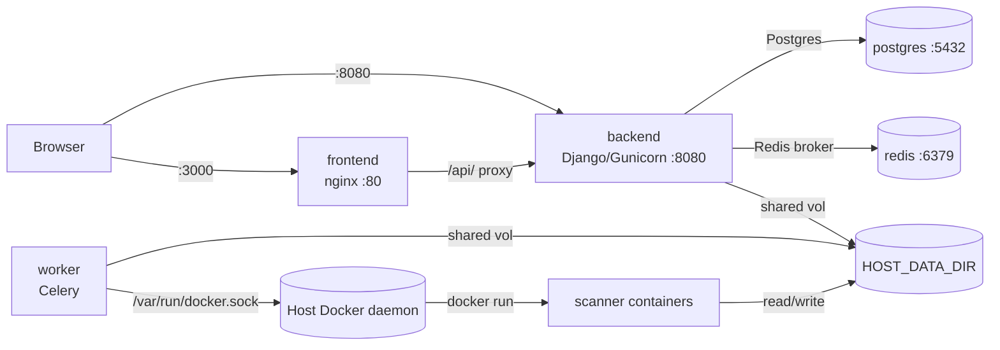

# Deployment

> Deploy and run the full Sentriq stack locally with Docker Compose.

## Role in the pipeline

The Compose stack wires together Postgres, Redis, the Django/Celery backend, and the React frontend so a single `docker compose up --build` brings up the whole product. It is the operational layer that turns the individual components into a runnable system: the API serves on port `8080`, the UI on port `3000`, and the worker executes scanner containers through the host Docker daemon.

## How it works

Five services are defined in `docker-compose.yml`:

- `postgres` — Postgres 16 for scan state, findings, triage, fixes, and audit history.
- `redis` — Celery broker and result backend.
- `backend` — Django/DRF API served by Gunicorn on `0.0.0.0:8080`.
- `worker` — Celery worker that clones repositories and runs scanner containers.
- `frontend` — Vite-built React SPA served by nginx on port `80`, exposed as `3000` on the host.

Both `backend` and `worker` are built from the same `ci-utils/Dockerfile` image. The backend service runs the default command (migrations + Gunicorn), while the worker service overrides the command to run Celery. The worker mounts `/var/run/docker.sock` so it can ask the host Docker daemon to create scanner containers, and it bind-mounts the shared data directory at the same absolute path as on the host so nested scanner mounts resolve correctly (the DinD path trick).

Configuration comes from `.env`, which is not committed. Key variables include the DeepSeek API key and model, Postgres/Redis connection details, `SCANNER_NETWORK`, and `LLM_ENABLED`. (The auto-fix severity floor is per-scan, chosen in the UI — not an env var.)

To start everything:

```bash
docker compose up --build
```

Then open the UI at `http://localhost:3000` and the API at `http://localhost:8080`.

Scanner images are pulled on demand during the first scan that uses them, not at stack start. For local development without containers, `USE_SQLITE=1` lets Django use a local SQLite file instead of Postgres.

## Code walkthrough

The compose file opens with the DinD path note that explains why the shared volume is mounted identically on host and worker:

```yaml
# Sentriq — full local stack (no k8s). Scanners run as their official
# containers via the host docker daemon (worker mounts docker.sock).
#
# DinD volume note: `docker run -v SRC:DST` in the worker resolves SRC on the
# HOST daemon. So the shared data dir is bind-mounted at the IDENTICAL absolute
# path on host and inside the worker (${HOST_DATA_DIR}:${HOST_DATA_DIR}), and
# SENTRIQ_DATA_DIR points there — making nested mounts resolve correctly.
```

Postgres and Redis are straightforward dependency services with healthchecks:

```yaml
services:
  postgres:
    image: postgres:16-alpine
    environment:
      POSTGRES_DB: ${POSTGRES_DB}
      POSTGRES_USER: ${POSTGRES_USER}
      POSTGRES_PASSWORD: ${POSTGRES_PASSWORD}
    volumes:
      - pgdata:/var/lib/postgresql/data
    healthcheck:
      test: ["CMD-SHELL", "pg_isready -U ${POSTGRES_USER}"]
      interval: 5s
      timeout: 3s
      retries: 10

  redis:
    image: redis:7-alpine
    healthcheck:
      test: ["CMD", "redis-cli", "ping"]
      interval: 5s
      timeout: 3s
      retries: 10
```

The backend service builds `ci-utils`, loads `.env`, sets `SENTRIQ_DATA_DIR` to the host data path, waits for healthy Postgres/Redis, exposes port `8080`, and bind-mounts the shared data dir:

```yaml
  backend:
    build: ./ci-utils
    env_file: .env
    environment:
      SENTRIQ_DATA_DIR: ${HOST_DATA_DIR}
    depends_on:
      postgres: { condition: service_healthy }
      redis: { condition: service_healthy }
    ports:
      - "8080:8080"
    volumes:
      - ${HOST_DATA_DIR}:${HOST_DATA_DIR}
```

The worker uses the same image but overrides the command to Celery. It mounts both `docker.sock` and the shared data directory:

```yaml
  worker:
    build: ./ci-utils
    command: celery -A ciutils worker --loglevel=info --concurrency=2
    env_file: .env
    environment:
      SENTRIQ_DATA_DIR: ${HOST_DATA_DIR}
    depends_on:
      postgres: { condition: service_healthy }
      redis: { condition: service_healthy }
      backend: { condition: service_started }
    volumes:
      # docker socket: the worker runs scanner containers on the host daemon.
      - /var/run/docker.sock:/var/run/docker.sock
      # shared data dir at an identical path (see header note).
      - ${HOST_DATA_DIR}:${HOST_DATA_DIR}
```

The frontend service builds the Vite app and serves it through nginx, exposing port `3000` on the host:

```yaml
  frontend:
    build: ./sentriq-frontend
    depends_on:
      - backend
    ports:
      - "3000:80"
```

The backend image installs `git` and the Docker CLI so the worker can clone repositories and invoke scanner containers through the mounted socket:

```dockerfile
FROM python:3.11-slim-bookworm

ENV PYTHONUNBUFFERED=1 PYTHONDONTWRITEBYTECODE=1

RUN apt-get update && apt-get install -y --no-install-recommends \
        git ca-certificates curl gnupg build-essential libpq-dev \
    && install -m 0755 -d /etc/apt/keyrings \
    && curl -fsSL https://download.docker.com/linux/debian/gpg \
        | gpg --dearmor -o /etc/apt/keyrings/docker.gpg \
    && echo "deb [arch=$(dpkg --print-architecture) signed-by=/etc/apt/keyrings/docker.gpg] \
https://download.docker.com/linux/debian bookworm stable" \
        > /etc/apt/sources.list.d/docker.list \
    && apt-get update && apt-get install -y --no-install-recommends docker-ce-cli \
    && apt-get purge -y build-essential && apt-get autoremove -y \
    && rm -rf /var/lib/apt/lists/*

WORKDIR /app
COPY requirements.txt .
RUN pip install --no-cache-dir -r requirements.txt

COPY . .

EXPOSE 8080
# Default command runs the API (migrations first). The worker service overrides
# this with a celery command (see docker-compose.yml).
CMD ["sh", "-c", "python manage.py migrate --noinput && gunicorn ciutils.wsgi:application --bind 0.0.0.0:8080 --workers 3 --timeout 120 --access-logfile - --error-logfile -"]
```

The frontend Dockerfile builds the SPA and copies the resulting bundle into an nginx image:

```dockerfile
# Build the Vite bundle, then serve it statically with nginx (which also
# reverse-proxies /api to the backend so the SPA is single-origin).
FROM node:20-alpine AS build
WORKDIR /app
COPY package.json package-lock.json* ./
RUN npm install
COPY . .
RUN npm run build

FROM nginx:1.27-alpine
COPY nginx.conf /etc/nginx/conf.d/default.conf
COPY --from=build /app/dist /usr/share/nginx/html
EXPOSE 80
```

Nginx serves the static bundle and proxies `/api/` requests to the backend, keeping the browser on a single origin:

```nginx
server {
    listen 80;
    server_name _;
    root /usr/share/nginx/html;
    index index.html;

    # SPA: serve index.html for any non-file route.
    location / {
        try_files $uri $uri/ /index.html;
    }

    # Proxy API calls to the Django backend (single-origin for the browser).
    location /api/ {
        proxy_pass http://backend:8080;
        proxy_set_header Host $host;
        proxy_set_header X-Forwarded-For $proxy_add_x_forwarded_for;
        proxy_read_timeout 120s;
    }
}
```

`.env.example` lists the variables the stack expects:

```bash
# Copy to .env and fill in. .env is gitignored.

# ---- DeepSeek LLM ----
DEEPSEEK_API_KEY=sk-your-deepseek-key
DEEPSEEK_MODEL=deepseek-v4-flash
DEEPSEEK_BASE_URL=https://api.deepseek.com
LLM_ENABLED=true

# ---- Postgres ----
POSTGRES_DB=sentriq
POSTGRES_USER=sentriq
POSTGRES_PASSWORD=sentriq
POSTGRES_HOST=postgres
POSTGRES_PORT=5432

# ---- Redis ----
REDIS_URL=redis://redis:6379/0

# ---- Scan execution ----
HOST_DATA_DIR=/tmp/sentriq-data
SCANNER_NETWORK=host
TOOL_TIMEOUT_SECONDS=900

# ---- Django ----
DJANGO_DEBUG=false
DJANGO_SECRET_KEY=change-me-in-production
LOG_LEVEL=INFO
```

For local development without the database container, the backend supports an SQLite escape hatch:

```python
if os.getenv("USE_SQLITE") == "1":
    # Local-only escape hatch (e.g. running checks/migrations without Postgres).
    DATABASES = {"default": {"ENGINE": "django.db.backends.sqlite3",
                             "NAME": os.path.join(BASE_DIR, "local.sqlite3")}}
```

## Diagram



## Key decisions & gotchas

- **One backend image, two roles.** Both `backend` and `worker` build from `ci-utils/Dockerfile`; only the Compose `command` differs. This keeps the deployed artifact identical and avoids dependency drift between API and task code.
- **The worker needs the host Docker socket.** Mounting `/var/run/docker.sock` lets the worker ask the host daemon to run scanner containers. The worker therefore runs as root; the scanner containers themselves are still isolated.
- **HOST_DATA_DIR must be the same absolute path on host and inside the worker.** Because `docker run -v SRC:DST` resolves `SRC` on the host daemon, the shared data directory is bind-mounted as `${HOST_DATA_DIR}:${HOST_DATA_DIR}` and `SENTRIQ_DATA_DIR` points to that same path. See [03-executor](03-executor.md) for the full DinD path explanation.
- **Scanner images are pulled on demand.** The stack does not pre-pull scanner images; the first scan that needs a given image triggers a pull through the host daemon.
- **Single-origin frontend via nginx.** The React SPA is served from `localhost:3000`, and nginx proxies `/api/` to the backend so the browser does not need CORS or a separate API origin.
- **USE_SQLITE=1 is for local development only.** It bypasses Postgres so migrations and checks can run without the full stack, but it is not used in the Docker deployment.
- **Scan timeout and network are configurable.** `TOOL_TIMEOUT_SECONDS` controls per-tool Celery timeouts, and `SCANNER_NETWORK` (default `host`) determines the Docker network mode for dynamic scanners.

## Related docs

- [03-executor](03-executor.md) — details of the Docker-in-Docker path trick and how scanner containers are invoked.
- [07-orchestration](07-orchestration.md) — how scans are queued and picked up by the Celery worker.
- [08-api](08-api.md) — the Django/DRF API served by the backend service.
- [09-frontend](09-frontend.md) — the React SPA built and served by the frontend service.
