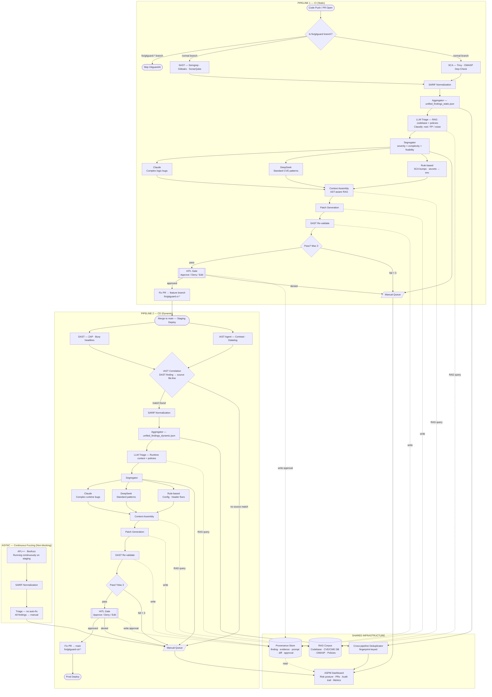

# Sentriq AI

```mermaid
flowchart TD
    subgraph CI["PIPELINE 1 — CI  (Static)"]
        PUSH([Code Push / PR Open])
        BRANCH{Is fix/gitguard branch?}
        SKIP([Skip GitguardAI])
        SAST["SAST — Semgrep · Gitleaks · SonarQube"]
        SCA["SCA — Trivy · OWASP Dep-Check"]
        SARIF1[SARIF Normalization]
        AGG1["Aggregator — unified_findings_static.json"]
        TRIAGE1["LLM Triage — RAG: codebase + policies\nClassify: real / FP / noise"]
        SEG1["Segregator\nseverity × complexity × fixability"]
        CLAUDE1["Claude\nComplex logic bugs"]
        DEEPSEEK1["DeepSeek\nStandard CVE patterns"]
        RULES1["Rule-based\nSCA bumps · secrets → env"]
        MANUAL1_CI[/"Manual Queue"/]
        CTX1["Context Assembly\nAST-aware RAG"]
        PATCH1[Patch Generation]
        REVAL1[SAST Re-validate]
        RETRY1{Pass? Max 3}
        HITL1[["HITL Gate\nApprove / Deny / Edit"]]
        PR1["Fix PR → feature branch\nfix/gitguard-ci-*"]
    end

    subgraph CD["PIPELINE 2 — CD  (Dynamic)"]
        MERGE([Merge to main — Staging Deploy])
        DAST["DAST — ZAP · Burp headless"]
        IAST["IAST Agent — Contrast · Datadog"]
        IAST_MAP{"IAST Correlation\nDAST finding → source file:line"}
        SARIF2[SARIF Normalization]
        AGG2["Aggregator — unified_findings_dynamic.json"]
        TRIAGE2["LLM Triage — Runtime context + policies"]
        SEG2[Segregator]
        CLAUDE2["Claude\nComplex runtime bugs"]
        DEEPSEEK2["DeepSeek\nStandard patterns"]
        RULES2["Rule-based\nConfig · header fixes"]
        MANUAL2_CD[/"Manual Queue"/]
        CTX2[Context Assembly]
        PATCH2[Patch Generation]
        REVAL2[DAST Re-validate]
        RETRY2{Pass? Max 3}
        HITL2[["HITL Gate\nApprove / Deny / Edit"]]
        PR2["Fix PR → main\nfix/gitguard-cd-*"]
        PROD([Prod Deploy])
    end

    subgraph FUZZING["ASYNC — Continuous Fuzzing  (Non-blocking)"]
        FUZZER["AFL++ · Boofuzz\nRunning continuously on staging"]
        FUZZ_SARIF[SARIF Normalization]
        FUZZ_TRIAGE["Triage — no auto-fix\nAll findings → manual"]
    end

    subgraph SHARED["SHARED INFRASTRUCTURE"]
        RAG[("RAG Corpus\nCodebase · CVE/CWE DB · OWASP · Policies")]
        DEDUP["Cross-pipeline Deduplicator\nfingerprint-keyed"]
        PROV[("Provenance Store\nfinding · evidence · prompt · diff · approval")]
        ASPM["ASPM Dashboard\nRisk posture · PRs · Audit trail · Metrics"]
    end

    %% CI Flow
    PUSH --> BRANCH
    BRANCH -->|"fix/gitguard-* branch"| SKIP
    BRANCH -->|normal branch| SAST & SCA
    SAST --> SARIF1
    SCA --> SARIF1
    SARIF1 --> AGG1 --> TRIAGE1 --> SEG1
    SEG1 --> CLAUDE1 & DEEPSEEK1 & RULES1 & MANUAL1_CI
    CLAUDE1 & DEEPSEEK1 & RULES1 --> CTX1 --> PATCH1 --> REVAL1 --> RETRY1
    RETRY1 -->|pass| HITL1
    RETRY1 -->|"fail × 3"| MANUAL1_CI
    HITL1 -->|approved| PR1
    HITL1 -->|denied| MANUAL1_CI
    PR1 --> MERGE

    %% CD Flow
    MERGE --> DAST & IAST
    DAST & IAST --> IAST_MAP
    IAST_MAP -->|"match found"| SARIF2
    IAST_MAP -->|"no source match"| MANUAL2_CD
    SARIF2 --> AGG2 --> TRIAGE2 --> SEG2
    SEG2 --> CLAUDE2 & DEEPSEEK2 & RULES2 & MANUAL2_CD
    CLAUDE2 & DEEPSEEK2 & RULES2 --> CTX2 --> PATCH2 --> REVAL2 --> RETRY2
    RETRY2 -->|pass| HITL2
    RETRY2 -->|"fail × 3"| MANUAL2_CD
    HITL2 -->|approved| PR2
    HITL2 -->|denied| MANUAL2_CD
    PR2 --> PROD

    %% Async Fuzzing feeds CD manual queue
    FUZZER --> FUZZ_SARIF --> FUZZ_TRIAGE --> MANUAL2_CD

    %% Cross-pipeline dedup
    AGG1 --> DEDUP
    AGG2 --> DEDUP
    DEDUP --> ASPM

    %% RAG queries (dotted)
    TRIAGE1 -.->|RAG query| RAG
    CTX1 -.->|RAG query| RAG
    TRIAGE2 -.->|RAG query| RAG
    CTX2 -.->|RAG query| RAG

    %% Provenance writes (dotted)
    PATCH1 -.->|write| PROV
    REVAL1 -.->|write| PROV
    HITL1 -.->|write approval| PROV
    PATCH2 -.->|write| PROV
    REVAL2 -.->|write| PROV
    HITL2 -.->|write approval| PROV

    %% ASPM reads
    PROV -.->|read| ASPM
    MANUAL1_CI --> ASPM
    MANUAL2_CD --> ASPM

```

[Tasks](Sentriq%20AI/Tasks%2037e3b32ef02c80cfb503f55be5b263b0.md)

[Sentriq SaaS](Sentriq%20AI/Sentriq%20SaaS%2037e3b32ef02c80ba886def81008dbf3c.md)